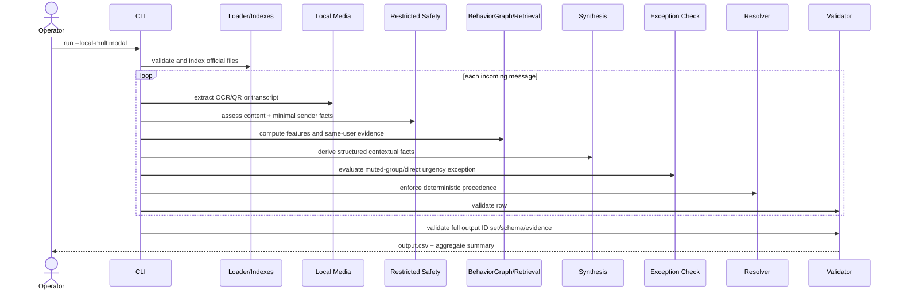
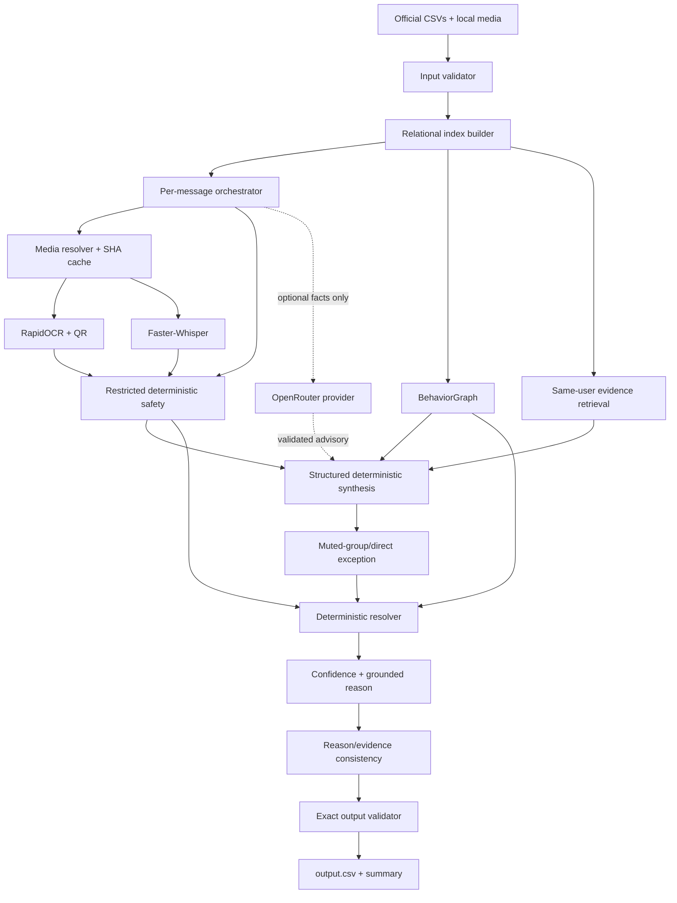
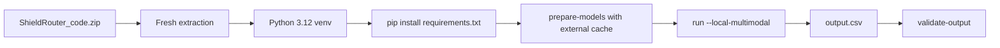

# ShieldRouter — Final Implementation-Ready Technical

**Project:** ShieldRouter
**Event:** HackerRank Orchestrate — August 2026
**Challenge:** Message Notification Router
**Document version:** 2.0-final-alignment
**Status:** Implementation-ready completion specification
**Date:** 2026-08-02 03:19 IST
**Technical/Product owner:** Solo participant
**Target repository branch:** `feat/shieldrouter`
**Validated baseline tag:** `local-multimodal-valid-v2`
**Validated baseline commit:** `ac5817963e28c5630ed63154d97fd276036dfda2`
**Protected output SHA-256:** `A819A2AF4F32687419F342E18D5320C0C3EBB41A2F4385430D153E5842E4686D`

> **Positioning:** ShieldRouter combines actual message content, recipient relationships and behavior, and non-negotiable safety policy. It can personalize away noise. It can never personalize away credential-theft risk.

---

## Source-of-truth hierarchy

When any source conflicts, implementation and release decisions must use this order:

1. `AGENTS.md` and its mandatory append-only transcript rules.
2. `problem_statement.md`.
3. Actual participant-facing CSV headers and local media files.
4. `docs/ShieldRouter_Implementation_Ready_Spec.md`.
5. `docs/shieldrouter_tech_design.md`.
6. This final implementation document.
7. Illustrative examples, historical HackerRank blog posts, and optional provider documentation.

The unified design contains inferred schemas and illustrative model outputs. They are **not** authoritative where they conflict with the official challenge. The submitted output remains exactly:

```text
message_id,action,message_type,reason,confidence,evidence_message_ids
```

Allowed actions:

```text
notify, digest, mute
```

Allowed message types:

```text
personal, urgent, event, payment, business_update, promotion,
greeting, forward, spam, scam, unknown
```

No `user_id`, `risk_flags`, hidden labels, organizer-only data, or extra columns may be added to the submitted CSV.

---

# 1. Document control

| Field | Value |
|---|---|
| Project | ShieldRouter |
| Event | HackerRank Orchestrate August 2026 |
| Track | Single fixed Message Notification Router challenge |
| Problem | Route each WhatsApp-style incoming message to `notify`, `digest`, or `mute` using multimodal content, recipient context, history, and safety |
| Status | Final implementation-ready completion blueprint |
| Technical owner | Solo participant |
| Product owner | Solo participant |
| Intended readers | Participant, Codex/agent, HackerRank evaluator, AI Judge |
| Primary design input | `docs/shieldrouter_tech_design.md` |
| Corrected specification | `docs/ShieldRouter_Implementation_Ready_Spec.md` |
| Runtime baseline | `local-multimodal-valid-v2` |
| Delivery format | Python 3.12 terminal application |
| Submission artifacts | `code.zip`, `output.csv`, `chat_transcript` |

## Assumptions

- The challenge remains a solo, 24-hour Orchestrate event.
- The evaluator supplies the participant dataset externally.
- The selected release should run locally after one-time model preparation.
- Network access and external API credentials cannot be assumed during evaluation.
- The existing dataset currently contains 110 incoming messages, 15 image messages, and 8 voice messages; code must not hardcode those counts.
- Exact August judging weights are not published in the challenge repository. Historical weights must not be represented as confirmed August weights.
- Packaging size and portal validation must be rechecked on the actual submission form immediately before upload.

## Open questions requiring final verification

- Whether the portal renames the transcript file automatically.
- Whether any additional text description is requested during upload.
- Whether the evaluator executes `prepare-models` with network access or expects a pre-existing Whisper cache.
- Whether the ZIP maximum remains 50 MB at final upload.
- Whether the AI Judge interview must be completed before the submission deadline or merely opened after submission.

---

# 2. Executive technical summary

ShieldRouter is a deterministic, personalized, multimodal terminal router. It loads official CSVs, validates relationships and media paths, reads real image and audio bytes, builds user/group/business/history indexes, applies an input-restricted safety gate, computes explainable BehaviorGraph features, retrieves same-user historical evidence, synthesizes structured routing facts, applies a code-owned policy resolver, calibrates confidence, and writes a complete six-column output.

The selected architecture is **local multimodal and zero-provider**:

- Images: RapidOCR + ONNX Runtime + Pillow + OpenCV QR detection.
- Voice: Faster-Whisper `small`, CPU/int8, prepared once outside the repository.
- Text/context: deterministic normalization, safety rules, personalization, retrieval, synthesis, resolver, reasons, and confidence.
- Optional online advisory: OpenRouter-compatible structured facts only; never owns the final action and is not the selected candidate.
- Final action: deterministic code only.

The key innovation is structural safety isolation. Safety assessment receives message/media content and minimal sender legitimacy, but not recipient engagement or preference data. A later personalization stage can reduce noise but cannot downgrade decisive credential-theft or integrity risk.

The validated baseline already demonstrates:

- 78 tests in a clean Python 3.12 environment.
- 110 valid output rows and 110 unique IDs.
- 15/15 image extraction successes.
- 8/8 voice transcription successes after model preparation.
- Zero external-provider requests in selected mode.
- Byte-identical clean reproduction of the protected output.

The final completion sprint must add the remaining revised-design alignment without destabilizing that baseline: explicit novelty, explicit transaction relationship, bounded forwarding fatigue, a first-class exception-check stage, transcript-derived voice tone/pressure metadata, reason/action consistency validation, corrected prompt templates, structured run summaries, the complete ten-category test map, controlled safety ablation, and final release packaging.

---

# 3. Idea interpretation

## Core concept

A recipient-centric message router that treats interruption as a scarce resource. It identifies immediate attention, deferred usefulness, and unwanted or unsafe content with a strict precedence:

1. Decisive safety risk → `mute`.
2. Trusted, direct, time-critical urgency → `notify`, including muted-group/quiet-hours exceptions.
3. Explicit promotion opt-out or severe fatigue → `mute`.
4. Useful but noncritical or timing-sensitive content → `digest`.
5. Uncertain content → `digest`.

## Target users

- Primary conceptual user: a WhatsApp recipient receiving mixed personal, group, business, image, voice, promotion, forwarding, payment, event, and scam content.
- Actual software operator: the solo participant or evaluator running a local CLI over the supplied dataset.
- Secondary reviewer: the AI Judge inspecting architecture, traces, tradeoffs, safety isolation, and failure handling.

## User pain points

- Important updates are lost in notification noise.
- Muting an entire group can hide urgent direct mentions.
- Promotions are useful to some users and unwanted by others.
- Trusted businesses and impostors can use similar language.
- Image posters and voice notes may contain the decisive information.
- Engagement history can improperly bias a naive safety classifier.

## Unique value proposition

ShieldRouter combines **real multimodal extraction**, **structural safety isolation**, **explainable personalization**, **same-user evidence**, and a **deterministic final resolver** in a reproducible local pipeline.

## Project boundaries

In scope:

- Batch CLI processing of official CSVs and local media.
- One prediction for each incoming message.
- Offline/local multimodal execution.
- Optional advisory provider abstraction.
- Evaluation, traces, audits, and release artifacts.

Out of scope:

- WhatsApp transport or live notification delivery.
- Frontend/dashboard.
- HTTP API.
- Authentication, RBAC, sessions, or user registration.
- Database server, vector database, graph database, queue, cloud deployment.
- Production monitoring infrastructure.
- Training a custom model.
- Visiting URLs or QR-code destinations.
- External web knowledge during routing.

## Corrections to the unified design

- Inferred CSV fields are replaced by the official schemas.
- `daily_notification_summary.csv` is historical load context, not a configured per-user maximum.
- The local deterministic safety gate is a real primary implementation, not an “amateur fallback.”
- Justification-first output ordering is not treated as proof of causal reasoning; evidence-first facts and consistency checks are used.
- Mandatory two-LLM-call processing is rejected for the selected candidate because it reduces reproducibility and depends on provider availability.
- `social`, `admin`, `other`, and `scam_or_risk` are not valid submitted message types.
- `risk_flags` remain internal trace data, not an output column.
- Voice tone in the completion sprint is explicitly transcript-derived linguistic tone, not acoustic emotion/prosody analysis.

---

# 4. Event-alignment matrix

| Event requirement | Source | Project response | Technical implementation | Judge evidence | Status | Risk |
|---|---|---|---|---|---|---|
| Build an AI-powered message router | Problem statement | Multistage local AI/ML + deterministic policy | OCR, ASR, structured facts, BehaviorGraph, resolver | Architecture and traces | Compliant | Low |
| Process text, image, voice | Problem statement | Read actual local media | RapidOCR/OpenCV and Faster-Whisper | 15/15 images, 8/8 voice | Compliant | Low |
| Personalized routing | Problem statement | User/group/business/history features | BehaviorGraph + evidence retrieval | Pair tests and trace report | Compliant after final pair report | Medium |
| Safety overrides preference | Problem statement/design | Restricted safety inputs + resolver precedence | `safety_rules.py`, payload tests, resolver | Scam/high-affinity adversarial case | Compliant | Low |
| Exact six-column output | Problem statement | Strict serializer/validator | `OUTPUT_COLUMNS`, enum/range/ID validation | Output validator | Compliant | Critical if changed |
| One row per incoming message | Problem statement | Per-row recovery + ID equality | Orchestrator boundary and validator | 110/110 report | Compliant | Critical |
| Relevant historical evidence | Problem statement | Same-user TF-IDF + metadata rerank | `retrieval.py` and evidence audit | 0 invalid/weak evidence | Compliant | Low |
| Reason consistency | Evaluation criteria | Grounded reason builder + final consistency validator | Completion sprint item | Full consistency report | Partial until implemented | Medium |
| Reasonable confidence | Evaluation criteria | Deterministic agreement calibration | `confidence.py` | Distribution and sample metrics | Compliant | Low |
| Evaluation workflow | Problem statement | Sample, adversarial, ablation, determinism | CLI/reports/tests | Final evaluation report | Partial until final ablation map | Medium |
| No label/message-ID hardcoding | Challenge integrity | Production routing-only loader and audits | Leakage scan/tests | `final_leakage_audit.txt` | Compliant | Disqualification risk |
| Submit code/output/transcript | Problem statement/portal | Clean package plan | Packaging script and manifest | Clean-room report | Pending | Critical |
| Solo challenge | Official event | One participant and agent transcript | Git/log records | Transcript | Compliant | Critical |
| 30-minute AI Judge interview | Official event | AI Judge brief and three demo traces | Offline trace commands | Interview brief | Pending execution | High |
| Sponsor technology | No mandatory sponsor confirmed | No artificial lock-in | Provider-agnostic optional path | Honest README | Compliant | Low |
| Deployment/public URL/video | Not required by repository | Omitted | Local CLI package | README | Compliant | Low |
| Secret hygiene | AGENTS/spec | No secrets in repo/artifacts | `.gitignore`, scans, redaction | Audit reports | Compliant; recheck package | Critical |

---

# 5. Judging-optimization strategy

Official August weights are **not confirmed**. Optimize evidence across the four publicly described signals: code, output, transcript, and AI Judge interview.

| Criterion/signal | Official weight | Product evidence | Technical evidence | Demo evidence | Submission evidence | Recommended effort |
|---|---:|---|---|---|---|---:|
| Output action correctness | Not confirmed | Personalized routing | Sample confusion matrix, hidden-generalizable rules | Trace correct urgent/scam/promo cases | `output.csv` | Highest |
| Message-type correctness | Not confirmed | Official enum classifier | Type metrics and error analysis | Media type changes | `output.csv`, eval report | High |
| Reason usefulness | Not confirmed | Concise grounded reason | Consistency validator | Explain one trace line by line | Output + report | High |
| Evidence relevance | Not confirmed | Same-user history | Audit, threshold, reranking | Show selected history rows | Output + audit | High |
| Confidence quality | Not confirmed | Agreement-based confidence | Calibration distribution | Compare clear vs ambiguous | Output + report | Medium |
| Multimodal completeness | Not separately published | Real images and voice | 15/15 and 8/8 metrics | Poster and voice examples | Code/eval | High |
| Architecture/robustness | Not confirmed | Safety isolation, fallback | Clean run, failure injection, zero network | Disable provider/model case | Code ZIP | Highest |
| AI collaboration/transcript | Not confirmed | Iterative engineering record | Append-only log | Explain decisions honestly | Transcript | High |
| AI Judge ownership | Not confirmed | Clear design tradeoffs | AI Judge brief, ADRs | Three rehearsed cases | Interview | Highest |
| Honesty/limitations | Prior edition emphasized | Explicit limitations | Fresh-cache vs cached runtime, OCR limits | State what is not acoustic/visual VLM | README/report/interview | High |

Pitch anchor:

> “The model never owns the final decision. Media models extract facts, safety is isolated from engagement history, and deterministic code enforces the final precedence.”

---

# 6. Functional requirements

## FR-001 — Validate official inputs

- **User:** operator/evaluator
- **Trigger:** `validate-input` or `run`
- **Inputs:** participant dataset directory
- **Main flow:** validate exact headers, UTF-8, IDs, booleans, timestamps, foreign references, media IDs, path containment
- **Failure:** exit nonzero before generating predictions for dataset-level structural errors
- **Priority:** P0
- **Acceptance:** official dataset validates; malformed fixtures fail with actionable sanitized errors

## FR-002 — Build context indexes

- Index users, groups, memberships, businesses, user-business relationships, history, events, daily summaries, images, and voice notes.
- Missing optional context yields neutral features and explicit missing-context indicators.
- **Priority:** P0
- **Acceptance:** O(1)-style lookup maps; no cross-user history leakage.

## FR-003 — Process image messages

- Resolve `media_id` through `images.csv`.
- Enforce dataset path containment and file safety.
- Read bytes, verify/decode image, OCR visible text, detect QR locally, extract structured dates/prices/domains/phones/safety/urgency/promotion facts.
- Cache by content hash and extraction-version tuple.
- **Priority:** P0
- **Acceptance:** every image returns facts or explicit failure; row preserved.

## FR-004 — Process voice notes

- Resolve through `voice_notes.csv`.
- Transcribe locally using prepared Faster-Whisper model.
- Preserve language and transcript.
- Derive linguistic tone and pressure metadata.
- Cache by audio hash and transcription settings.
- **Priority:** P0
- **Acceptance:** every voice returns transcript/failure; row preserved.

## FR-005 — Restricted safety gate

- Inputs: normalized message text, extracted media facts, forwarding count, minimal sender/business legitimacy.
- Excludes: user opens/replies/dismissals, promotion preferences, affinity, fatigue, evidence reactions.
- Detects credential requests, payment/QR pressure, account manipulation, suspicious/mismatched domains, prompt injection, chain forwarding, sender inconsistency.
- **Priority:** P0
- **Acceptance:** decisive scam remains high risk for high-affinity users.

## FR-006 — BehaviorGraph feature generation

Required explicit bounded fields:

- `trust`
- `affinity`
- `fatigue`
- `novelty`
- `urgency`
- `relationship_strength`
- `transaction_relationship`
- `promotion_opt_out`
- `group_muted`
- `in_quiet_hours`
- `relative_load`
- `direct_mention`
- `repeated`
- `missing_context`

- **Priority:** P0
- **Acceptance:** repeated/novel/missing-history fixtures and transaction/forwarding tests pass.

## FR-007 — Same-user historical evidence

- Retrieve at most five relevant IDs from `message_history.csv`.
- Candidate pool restricted by receiving `user_id`.
- Rank using TF-IDF-style similarity, sender/group/business/media match, and interaction evidence.
- Emit `none` when no candidate meets relevance.
- **Priority:** P0
- **Acceptance:** every non-none ID exists, belongs to same user, is relevant, and appears only once.

## FR-008 — Structured synthesis

Selected local mode:

- Deterministically derive urgency lens, direct mention, official message type, preliminary action, ambiguity, contextual facts, and recommendation.

Optional online mode:

- Accept advisory structured facts only.
- Safety result remains read-only.
- Output must use official enums.
- **Priority:** P1
- **Acceptance:** malformed provider output falls back without losing rows.

## FR-009 — Muted-group/direct-mention exception

- Execute after synthesis because it needs direct-mention and urgency facts.
- Inputs: mute state, direct mention, urgency, safety verdict, trust/relationship.
- Never override high risk.
- Produce explicit `ExceptionCheckResult`.
- **Priority:** P0 final-alignment item
- **Acceptance:** trusted critical mention can notify despite mute/DND; high-risk message cannot.

## FR-010 — Deterministic resolver

Precedence:

1. High-risk safety → `mute`.
2. Trusted critical direct urgency/exception → `notify`.
3. Explicit promotion opt-out or severe fatigue → `mute`.
4. Repeated low-value forwarding → `mute`.
5. Useful urgency during quiet hours/high load without critical exception → `digest`.
6. Safe useful nonurgent → `digest`.
7. Suspicious but nondecisive/ambiguous → `digest`.

- **Priority:** P0
- **Acceptance:** exhaustive decision matrix passes.

## FR-011 — Confidence calibration

- Compute 0–1 deterministic score using agreement, safety decisiveness, urgency clarity, evidence, media quality, missing context, ambiguity, and errors.
- Do not claim probability calibration.
- **Priority:** P1
- **Acceptance:** ambiguity/failures lower confidence; clear aligned cases score higher.

## FR-012 — Grounded reason and consistency validation

- Reasons must reference only available facts/features/evidence.
- Detect clear action/reason contradictions and unsupported evidence claims.
- Do not change correct actions based on keyword-only reason parsing.
- **Priority:** P0 final-alignment item
- **Acceptance:** full-output consistency report has zero unresolved critical contradictions.

## FR-013 — Exact output generation

- Preserve incoming order.
- Exactly one row per `messages.csv` row.
- Exact columns and enums.
- Confidence numeric 0–1.
- `none` or semicolon-separated valid evidence IDs.
- **Priority:** P0
- **Acceptance:** output validator exits 0 and ID-set equality holds.

## FR-014 — Trace and summary

- `trace` command exposes sanitized internal safety/features/evidence/synthesis/exception/resolver/confidence/errors for one message.
- `--summary-json` writes aggregate metrics without raw content.
- **Priority:** P1
- **Acceptance:** no secrets or raw transcript/OCR text in summary.

## FR-015 — Evaluation

- Sample metrics, confusion matrices, adversarial cases, pair tests, media tests, determinism, evidence, reason consistency, failure injection, ablations.
- **Priority:** P0
- **Acceptance:** generated reports with no production label leakage.

## FR-016 — Model preparation

- `prepare-models` initializes RapidOCR and downloads/caches configured Faster-Whisper outside repository.
- No API key.
- Selected routing uses local-files-only.
- **Priority:** P0
- **Acceptance:** fresh isolated cache preparation followed by zero-network run succeeds.

## FR-017 — Optional online advisory

- OpenRouter-compatible provider with budget ledger, strict structured validation, data-policy filter, retries, cache, sanitized errors.
- Advisory cannot own final action.
- **Priority:** P2
- **Acceptance:** provider failure produces deterministic fallback and complete output.

## FR-018 — Release packaging

- Produce clean `code.zip`, validated `output.csv`, and sanitized complete transcript.
- ZIP root contains runnable files.
- No dataset, models, caches, secrets, venv, or Git metadata.
- **Priority:** P0
- **Acceptance:** clean-room install/test/model preparation/run reproduces protected output.

---

# 7. Non-functional requirements

| ID | Area | Measurable target |
|---|---|---|
| NFR-001 | Completeness | 100% incoming IDs appear exactly once |
| NFR-002 | Schema | 100% exact header/order/enum/range validation |
| NFR-003 | Determinism | Same code/input/model/cache yields byte-identical CSV |
| NFR-004 | Clean reproducibility | Fresh Python 3.12 venv installs from requirements and all tests pass |
| NFR-005 | Fresh-cache runtime | Record measured runtime; current validated reference ≈89 seconds |
| NFR-006 | Cached runtime | Record separately from fresh extraction; do not mix measurements |
| NFR-007 | Reliability | No single row/media/provider error aborts batch |
| NFR-008 | Provider retries | At most one configured retry in current provider path; never unbounded |
| NFR-009 | Local selected mode | Exactly zero external-provider requests |
| NFR-010 | Evidence isolation | 100% non-none evidence belongs to receiving user |
| NFR-011 | Path safety | No media file outside dataset root can be opened |
| NFR-012 | Secret hygiene | Zero real secrets in Git, ZIP, output, transcript |
| NFR-013 | Privacy | Selected mode sends no message content externally |
| NFR-014 | Cache integrity | Cache keys include media bytes hash and relevant version/settings |
| NFR-015 | Maintainability | Production modules remain separated by responsibility; no ID branches |
| NFR-016 | Observability | Aggregate counts/runtime/cache/fallbacks available without raw content |
| NFR-017 | Cost | Selected run API cost = US$0; local compute only |
| NFR-018 | Package size | Code ZIP below current portal maximum; verify portal before upload |
| NFR-019 | Demo reliability | All three key traces available offline |
| NFR-020 | Failure transparency | Extraction/provider/model failures are explicit and lower confidence |

---

# 8. User roles and permissions

| Role | Purpose | Authentication | Access | Permitted actions | Restrictions | Audit |
|---|---|---|---|---|---|---|
| Solo participant/operator | Build, validate, package, submit | OS/Git credentials only | Local repo/dataset/config | Run, test, evaluate, commit, package | No organizer-only labels, no hardcoding | Git + transcript |
| HackerRank evaluator | Execute and inspect | None in app | Code package + supplied dataset | Install, prepare models, run, validate | No secret required for selected mode | Output/report |
| AI Judge | Review decisions and ownership | Platform-controlled | Architecture, code, traces, reports | Ask technical questions | No app admin role | Interview |
| Optional provider | Advisory extraction | API key via environment | Minimal request fields only | Return schema-constrained facts | Cannot access entire history or choose action | Usage metadata |
| Untrusted message/media author | Supplies content | None | No application privileges | Content is data only | Cannot issue executable instructions | Safety signals |

No product-level registration, login, OAuth, sessions, or RBAC is required.

---

# 9. User stories

- **US-001 P0 — Validate dataset:** As operator, I want schema/path validation before routing so malformed inputs cannot create silent omissions.
- **US-002 P0 — Complete routing:** As evaluator, I want one valid prediction per incoming message.
- **US-003 P0 — Safety override:** As recipient, I want credential theft muted regardless of past engagement.
- **US-004 P0 — Urgent muted-group exception:** As recipient, I want a trusted critical direct mention to interrupt despite group mute.
- **US-005 P0 — Personalized promotion:** As recipient, I want promotions handled according to opt-in and dismissal history.
- **US-006 P0 — Image reasoning:** As recipient, I want poster/screenshot text, QR, date, price, and risk facts included.
- **US-007 P0 — Voice reasoning:** As recipient, I want voice transcript, urgency, and pressure language included.
- **US-008 P0 — Failure recovery:** As evaluator, I want media/provider failures to preserve every output row.
- **US-009 P1 — Explainability:** As AI Judge, I want a trace showing facts, features, evidence, exception, resolver rule, reason, and confidence.
- **US-010 P0 — No overfitting:** As organizer, I want production routing independent of sample labels and message IDs.
- **US-011 P1 — Pair demonstration:** As AI Judge, I want the same message routed differently for two users with opposite histories.
- **US-012 P0 — Fresh-machine setup:** As evaluator, I want one documented model preparation command followed by a zero-network run.
- **US-013 P0 — Submission package:** As participant, I want three clean upload artifacts verified in a fresh extraction.

Each P0 story is accepted only when automated tests and a generated report prove it.

---

# 10. End-to-end user journeys

## Primary successful journey



## First-time journey

1. Create Python 3.12 venv.
2. Install `code/requirements.txt`.
3. Set `HF_HOME` outside repository.
4. Run `python code/main.py prepare-models`.
5. Run input validation.
6. Run tests.
7. Run local multimodal generation.
8. Validate output.
9. Compare SHA/report.

## Failure-recovery journey

- Missing/corrupt image → explicit image failure facts → text/context routing → lower confidence → row retained.
- Missing Whisper cache → explicit voice failure → no implicit download during selected run → row retained; operator runs `prepare-models`.
- Provider unavailable → cached/advisory fallback → deterministic route.
- Malformed dataset-level schema → fail loudly before prediction.
- Unexpected per-row exception → conservative digest/unknown trace → complete batch.

## Judge demonstration journey

1. Show architecture and trust boundaries.
2. Trace a scam that remains muted despite strong relationship signals.
3. Trace same-message/two-user promotion difference.
4. Trace muted-group urgent direct mention.
5. Show image/voice media facts.
6. Show clean output validation and deterministic SHA.
7. State limitations and provider-independent release choice.

---

# 11. MVP definition

## Must build before submission

| Feature | Reason | Remaining effort | Dependency | Removal impact |
|---|---|---:|---|---|
| Official input/output validation | Submission correctness | Complete | None | Submission failure |
| Text/image/voice routing | Explicit challenge scope | Complete | Local models | Major score loss |
| Restricted safety + resolver | Core differentiation | Complete | Tests | Safety failure |
| BehaviorGraph + evidence | Personalization/evidence | Mostly complete | Final explicit fields | Lower score |
| Explicit exception stage | Revised design alignment | 1–2h | Synthesis facts | Judge/code mismatch |
| Reason consistency validator | Evaluation criterion | 1–2h | Reason/evidence | Risky contradictions |
| Ten-category test report | Proof of quality | 2–3h | Tests | Weaker judge evidence |
| Final operational/ablation report | Proof and honesty | 1–2h | Eval commands | Weaker interview |
| Clean packaging | Mandatory deliverable | 1–2h | Frozen code/output | Cannot submit |

## Should build

- Explicit novelty/transaction/forwarding fields.
- Transcript-derived tone/pressure.
- `--summary-json`.
- Corrected optional prompt templates.
- Three bookmarked demo traces and AI Judge one-page brief.

## Could build only after green release

- Relationship-path formatted reasons.
- More multilingual adversarial fixtures.
- Additional optional provider models.
- Async media preprocessing.
- SQLite cache.

## Do not build

- UI/dashboard.
- HTTP API.
- Authentication.
- Cloud deployment.
- Graph/vector database.
- Multi-agent jury.
- Acoustic emotion classifier.
- Mandatory provider calls.
- Self-critique third model pass.
- External URL/QR browsing.

---

# 12. Recommended technology stack

| Layer | Selected option | Purpose | Why selected | Limitation | Fallback |
|---|---|---|---|---|---|
| Runtime | Python 3.12 | CLI/data/ML orchestration | Validated clean environment | Requires local Python | Same version in venv |
| Validation | Pydantic + explicit CSV validators | Internal schemas/output checks | Strict, readable | Some raw CSV logic remains | Dataclass/manual checks |
| CSV/indexes | Standard library CSV + dict indexes | Official data loading | Low dependency, deterministic | Less concise than pandas | None required |
| Image OCR | RapidOCR + ONNX Runtime | Local visible text | Offline, packaged model assets | Limited scene understanding | Explicit low-info result |
| Image decode | Pillow/OpenCV | Safe decoding/metadata/QR | Mature local libraries | Native wheels enlarge ZIP install | Failure fallback |
| QR | OpenCV `QRCodeDetector` | Detect/decode QR text | No network/URL visit | Detection quality varies | `contains_qr=false/unknown` |
| Voice | Faster-Whisper `small`, CPU/int8 | Local multilingual ASR | Reproducible after preparation | One-time model download | Explicit transcript failure |
| Retrieval | In-code TF-IDF-style cosine + metadata rerank | Same-user evidence | No embeddings/vector DB | Lexical limitations | Metadata-only evidence |
| Routing | Deterministic rules/resolver | Final action | Auditable and stable | Rules require testing | Conservative digest |
| Optional provider | OpenRouter-compatible API | Advisory facts experiments | Structured output and free models available | Rate/availability/schema variability | Selected zero-network path |
| Cache | JSON/files by SHA-256 | Avoid repeated media/provider work | Simple and inspectable | Local-only | Recompute |
| Tests | pytest | Unit/integration/regression | Fast and validated | No hosted CI required | Clean-room command |
| Deployment | Clean local ZIP | Official deliverable | Matches challenge | Model preparation step | Explicit README |
| CI/CD | Manual release script/checklist | 24-hour solo event | Minimal overhead | Human execution | Tag + manifest |

No database, frontend, auth, queue, vector store, or cloud service is justified for the challenge.

---

# 13. System architecture



## Trust boundaries

1. Message/media content is untrusted data, never executable instruction.
2. Media paths are constrained to dataset root.
3. Safety does not receive personalization/engagement features.
4. Optional provider receives stage-minimal payload.
5. Provider/model output is untrusted and schema-validated.
6. Only deterministic resolver can assign the submitted action.
7. Output evidence is restricted to official same-user history IDs.
8. Secrets remain in environment and are excluded from artifacts.

## Component contracts

- **Loader:** validated tables or dataset-level error.
- **Media:** `MediaFacts` with status, facts, cache metadata, sanitized error.
- **Safety:** `safe|suspicious|high_risk`, risk level, signals, official type hint.
- **BehaviorGraph:** bounded explicit features.
- **Evidence:** ordered list of at most five valid candidate objects.
- **Synthesis:** urgency/direct mention/type/recommendation/ambiguity/grounded facts.
- **Exception:** eligibility + reason; cannot override high risk.
- **Resolver:** final action/type + resolver rule.
- **Confidence/reason:** deterministic and validated.
- **Output:** exact six-column row.

---

# 14. Data-flow documentation

Official tables:

```text
messages.csv
users.csv
groups.csv
group_members.csv
business_accounts.csv
user_business_history.csv
message_history.csv
message_events.csv
daily_notification_summary.csv
images.csv
voice_notes.csv
sample_messages.csv      # evaluation only
output.csv               # blank template, not a production input
```

Production routing must never read sample labels, prior evaluation reports, or baseline output decisions.

## Message processing flow

1. Load and validate the incoming row.
2. Resolve user and optional group/business/sender context.
3. Resolve media ID and safe local path.
4. Extract/cache media facts.
5. Create an enriched in-memory analysis text without changing source data.
6. Run restricted safety.
7. Retrieve same-user evidence.
8. Compute BehaviorGraph including novelty and transaction context.
9. Produce synthesis facts.
10. Evaluate exception.
11. Resolve final action/type.
12. Calibrate confidence.
13. Build grounded reason.
14. Validate reason/evidence consistency.
15. Serialize exact output row.
16. Validate complete output before atomic write.

## Data retention

- Source dataset remains unchanged.
- Cache contains derived facts keyed by hashes; excluded from Git/package.
- Transcript is maintained externally according to AGENTS.
- Submission output contains only required fields.
- Selected mode sends no data to external providers.
- Optional provider caches/errors must not include secrets.

---

# 15. Frontend specification

**Not applicable.**

ShieldRouter is an offline terminal application. There are no routes, screens, browser states, client-side components, accessibility surfaces, cookies, or frontend analytics.

The equivalent operator interface consists of CLI subcommands:

```text
prepare-models
validate-input
run
validate-output
evaluate-sample
trace
smoke-online
```

Required UX properties:

- Clear exit codes.
- Human-readable sanitized errors.
- Machine-readable optional summary JSON.
- No secret or raw sensitive-content logging.
- No spinner/progress dependency required for correctness.

---

# 16. Backend specification

The “backend” is a single-process Python application organized by deterministic service modules.

Recommended final module responsibilities:

```text
code/main.py
code/src/shieldrouter/
  io.py
  schemas.py
  indexes.py
  normalize.py
  media.py
  local_image.py
  provider.py
  online_ai.py
  safety_rules.py
  behaviorgraph.py
  retrieval.py
  fallback_synthesis.py
  exception_check.py          # final alignment
  resolver.py
  confidence.py
  reason.py
  consistency.py              # final alignment
  orchestrator.py
  validate.py
```

Rules:

- No hidden global mutable routing state.
- No production import from `evaluation/`.
- Every external/model response validates before use.
- Per-row errors are contained.
- Dataset-level structural errors stop the run.
- Cache and output writes use safe paths.
- Production logic contains no incoming message-ID branches.
- Resolver rules are pure and unit-testable.

---

# 17. API specification

No HTTP API is required.

## CLI contract

### `prepare-models`

```powershell
python code/main.py prepare-models
```

Purpose: prepare RapidOCR and Faster-Whisper caches outside repository.

### `validate-input`

```powershell
python code/main.py validate-input --dataset dataset
```

Success: exit 0 and validated row count.

### `run`

```powershell
python code/main.py run `
  --dataset dataset `
  --output output.csv `
  --local-multimodal `
  --cache-dir code/.shieldrouter_cache `
  --summary-json code/evaluation/run_summary.json
```

Modes are mutually exclusive where appropriate:

- `--offline`
- `--local-voice`
- `--local-multimodal`
- `--online`

### `validate-output`

```powershell
python code/main.py validate-output --dataset dataset --output output.csv
```

### `trace`

```powershell
python code/main.py trace --dataset dataset --message-id <id> --local-multimodal
```

Trace output must be sanitized and must not expose secrets.

---

# 18. Database design

No database is required.

The official CSV files are immutable source records. In-memory indexes are the application data-access layer.

Key index shapes:

```python
users_by_id: dict[str, UserRow]
groups_by_id: dict[str, GroupRow]
memberships_by_group_user: dict[tuple[str, str], GroupMemberRow]
businesses_by_id: dict[str, BusinessRow]
user_business_by_user_business: dict[tuple[str, str], UserBusinessRow]
history_by_user: dict[str, list[MessageRow]]
events_by_message: dict[str, MessageEventRow]
daily_by_user: dict[str, list[DailySummaryRow]]
images_by_id: dict[str, Path]
voices_by_id: dict[str, Path]
```

Cache storage is versioned file-based JSON, not authoritative data.

No migration or backup system is needed. Release reproducibility is provided by Git commits/tags, requirements, official dataset, and model preparation documentation.

---

# 19. AI and machine-learning specification

## AI use cases

1. OCR of image text.
2. QR detection/decoding.
3. Voice transcription.
4. Optional provider advisory facts.
5. Deterministic linguistic feature extraction and routing.

## Selected models/tools

- RapidOCR small packaged ONNX models.
- Faster-Whisper `small`, CPU/int8.
- Optional OpenRouter `openrouter/free` or configured compatible model for experiments only.

## Guardrails

- Message content is untrusted.
- Prompt-injection language becomes a safety signal.
- No URL or QR destination is opened.
- Safety input excludes engagement.
- Provider outputs are facts only.
- Structured schemas reject extra/invalid values.
- Resolver owns final decision.
- Failures preserve rows.

## Local media facts

Image:

```text
valid_media, visible_text, ocr_lines, mean_ocr_confidence,
width, height, mime_type, contains_qr, decoded_qr_text,
domains, phones, prices, dates, deadline/payment/credential/
urgent/promotion/injection language, visual signals, layout_type, error
```

Voice:

```text
status, transcript, language, model, detected_tone,
detected_pressure_language, urgency facts, error, cache metadata
```

`detected_tone` is transcript-derived:

- `urgent`: direct immediate deadline/emergency/call-now language.
- `calm`: explicit nonurgent/informational language with no pressure.
- `neutral`: informative/request content without decisive urgent/calm markers.
- `unknown`: empty/failed transcript.

## Optional prompts

The final repository should contain:

```text
code/prompts/safety_gate.md
code/prompts/synthesis.md
```

Both must use official enums and state that they apply only to optional online advisory mode. Prompt output never bypasses deterministic rules.

## Cost and latency

- Selected routing API cost: US$0.
- Local compute cost: evaluator hardware/time only.
- Fresh prepared-cache reference runtime: approximately 89 seconds for current dataset.
- Cached rerun must be reported separately.
- Optional provider free-model availability and latency are variable and not release-critical.

---

# 20. Retrieval and knowledge architecture

There is no external knowledge base or document RAG.

Evidence source:

```text
dataset/message_history.csv
dataset/message_events.csv
```

Retrieval procedure:

1. Restrict to current receiving user.
2. Tokenize normalized current/history text.
3. Compute local IDF over that user’s candidate history.
4. Compute cosine-style weighted lexical similarity.
5. Add bounded metadata reranking for same sender/group/business/media.
6. Add interaction relevance for opened/replied/dismissed/muted/reported history.
7. Enforce qualification threshold.
8. Sort deterministically by score then ID.
9. Return at most five.

Final alignment:

- Expose highest comparable similarity for `novelty = 1 - similarity`.
- Use a neutral documented novelty default when no comparable history exists.
- Never use evidence from another user.
- Never hallucinate IDs.
- Do not force evidence for every message.

---

# 21. External integrations

## Faster-Whisper model hub

- Purpose: one-time download of the `small` CTranslate2 model.
- Authentication: normally none for public model.
- Selected run: `local_files_only=True`.
- Failure: explicit `LocalEntryNotFoundError`; run `prepare-models`.
- Cache: outside repository via `HF_HOME`.
- Data sharing: model download only; message audio remains local.

## Optional OpenRouter

- Purpose: advisory structured semantic/image facts experiment.
- Authentication: `OPENROUTER_API_KEY`.
- Base URL: configured OpenAI-compatible endpoint.
- Controls: request budget, timeout, structured validation, `provider.data_collection=deny`, caching, sanitized errors.
- Failure: deterministic fallback.
- Selected candidate: does not use it.

No other external integration is required.

---

# 22. Authentication and authorization

Not applicable at application level.

Security requirements:

- Git remote authentication handled by developer tooling.
- Optional provider key read only from environment or ignored local `.env`.
- `.env` never committed or packaged.
- No password, session, refresh token, OAuth, account deletion, or demo account flow.

---

# 23. Security specification

| Threat | Attack path | Probability | Impact | Prevention | Detection | Response |
|---|---|---:|---:|---|---|---|
| Prompt injection | Message/OCR/transcript instructs router | High | High | Treat content as data; safety signal; deterministic resolver | Adversarial tests | Mute/digest and trace |
| Credential theft | OTP/PIN/card/payment request | High | High | Restricted safety rules | Safety tests | High-risk mute |
| Path traversal | Malicious media path | Medium | High | Resolve/contain inside dataset; symlink checks | Path tests | Explicit media failure |
| QR/URL SSRF | Decoded link is opened | Medium | High | Never fetch links | Test/mocking | Store untrusted string only |
| Secret leakage | Key in repo/log/ZIP | Medium | Critical | Env only, ignores, scans, redaction | Hygiene audit | Stop release and rotate |
| Cross-user evidence | Retrieval pool leakage | Low | High | User-index restriction and validator | Evidence audit | Fail validation |
| Label leakage | Sample labels read by production | Medium | Disqualification | Routing-only loader | Leakage audit | Stop/revert |
| Dependency failure | Missing native/model package | Medium | High | Clean venv, pinned ranges, prepare-models | Clean-room test | Document/fix |
| Model-cache absence | Whisper unavailable | High fresh machine | Medium | `prepare-models`, explicit local-only mode | Fresh-cache test | Prepare or fallback |
| Malformed model output | Provider returns wrong schema | High free models | Medium | Pydantic validation/cache only valid responses | Provider tests | Deterministic fallback |
| Resource exhaustion | Huge/corrupt image/audio | Low | Medium | File size/type limits, bounded processing | Media tests | Failure result |
| Excessive logging | Raw sensitive content in logs | Medium | High | Aggregate summaries and sanitized errors | Secret/content scan | Remove/redact before submission |

Not applicable web threats: XSS, CSRF, browser storage, HTTP broken access control, because no web application is served.

---

# 24. Privacy and data governance

| Data category | Purpose | Storage | External sharing | Retention | Sensitivity |
|---|---|---|---|---|---|
| Incoming message text | Routing | Official dataset/in memory | None selected mode | Challenge workspace | Potential PII |
| OCR text | Media reasoning | Cache/in memory | None selected mode | Cache until cleanup | Potential PII |
| Voice transcript | Routing | Cache/in memory | None selected mode | Cache until cleanup | Potential PII |
| User behavior | Personalization | Official CSV/in memory | Never sent to safety provider | Challenge workspace | Behavioral |
| Business metadata | Legitimacy/context | Official CSV/in memory | Minimal optional provider fields | Challenge workspace | Low/moderate |
| Evidence IDs | Explanation | Output | Submitted | Submission retention | Low |
| API key | Optional provider auth | Environment | OpenRouter auth header | Never logged | Secret |
| Transcript log | Development evidence | External required log | HackerRank submission | Event retention | May contain paths/prompts |

Rules:

- Do not use real additional user data.
- Do not browse extracted links.
- Do not send full corpus to providers.
- Redact actual secrets only; do not falsify the transcript.
- Remove private absolute paths from packaged documentation where unnecessary.
- Delete temporary venvs, caches, and extracted package verification directories after release checks.

---

# 25. Validation and error handling

| Error class | Internal behavior | User/operator message | Retry | Recovery |
|---|---|---|---|---|
| Dataset header/structure | Abort before routing | Exact table/field issue | No | Correct dataset |
| Missing optional relation | Neutral context + flag | Summary count | No | Continue |
| Invalid media ID/path | Failed media facts | Sanitized media error | No | Continue row |
| Corrupt image/audio | Failed extraction | Type-specific error | No/unbounded retry prohibited | Continue row |
| Missing model cache | Voice failures explicit | Run `prepare-models` | No during local-only run | Prepare model |
| OCR empty | Low-information facts | No fatal error | No | Use text/context |
| Provider 429/5xx | Bounded configured retry | Sanitized fallback | At most configured | Deterministic fallback |
| Provider auth/404/schema | No repeated waste | Sanitized fallback | Normally no | Deterministic fallback |
| Per-row unexpected exception | Conservative trace | `row_processing_error` | No | Digest/unknown row |
| Output inconsistency | Fail before release write or report | Exact row/field | No | Fix general logic |
| Secret detected | Stop packaging | File/category only, not value | No | Redact/remove/rotate |

No stack trace, credential, raw provider payload, or secret value should appear in user-visible release logs.

---

# 26. Observability

Minimum aggregate metrics:

```text
rows
unique_ids
action distribution
message-type distribution
confidence min/mean/max
evidence usage
fallback/error count
image attempted/succeeded/failed
voice attempted/succeeded/failed
OCR cache hits
transcript cache hits
provider requests/retries/fallbacks
runtime
output SHA-256
```

`--summary-json` must not include:

- Raw message text.
- OCR visible text.
- Voice transcripts.
- API keys.
- Authorization headers.
- Full local paths.
- Provider raw responses.

Trace mode may expose sanitized facts for a single chosen row but remains outside the submitted output.

---

# 27. Analytics and success metrics

| Metric | Formula/source | Current/target | Judging relevance |
|---|---|---|---|
| Output completeness | unique output IDs / incoming IDs | 100% | Critical |
| Action accuracy | correct sample actions / sample rows | Current local multimodal 1.0 on supplied sample | Output quality |
| Action macro F1 | class F1 mean | Current 1.0 sample | Balanced routing |
| Type accuracy/macro F1 | sample comparison | Current 1.0 sample | Category quality |
| Scam false positives | safe sample rows labeled scam | 0 target/current | Safety precision |
| Urgent false negatives | urgent sample rows not notified as expected | 0 target/current | Recall |
| Evidence validity | valid non-none evidence / used evidence | 100% | Auditability |
| Media success | successes / attempts | 15/15 image, 8/8 voice | Multimodal |
| Provider calls | selected run count | 0 | Reproducibility/privacy |
| Fresh runtime | wall clock | Record actual; ≈89s reference | Operations |
| Cached runtime | wall clock | Record separately | Caching |
| Determinism | identical bytes across repeats | Required | Reliability |
| Reason consistency | rows without critical contradiction / rows | 100% target | Explanation |
| Failure completion | output rows after injected row failure | 100% | Resilience |

Perfect sample metrics do not guarantee hidden-set performance and must be described honestly.

---

# 28. Testing strategy

Ten mandatory categories:

1. **Unit:** resolver, BehaviorGraph, safety, normalization, retrieval, consistency, exception.
2. **Schema/property:** headers, enums, confidence range, unique IDs, evidence format.
3. **Sample:** action/type metrics and confusion matrices.
4. **Adversarial:** credential theft, prompt injection, safe-looking scam, legitimate urgent cases.
5. **Pair:** same content with opposite user histories.
6. **Media:** real and mocked image/voice, QR, corrupt/missing/empty cases.
7. **Determinism:** repeated local multimodal runs.
8. **Evidence:** same-user/existence/relevance/limit.
9. **Reason consistency:** contradiction and unsupported-evidence cases.
10. **Failure injection:** missing cache/provider/API key/media/malformed provider/schema/per-row exceptions.

Minimum final suite must include:

- Novelty repeated/novel/no-history.
- Transaction separate from verification.
- Transaction cannot override safety.
- Bounded forwarding fatigue.
- Legitimate forwarded message not automatically muted.
- Exception stage high-risk block.
- Transcript-derived urgent/calm/neutral/unknown tone.
- Pressure language.
- Multilingual preservation.
- Reason/action/evidence contradiction tests.
- Summary JSON privacy and schema.
- Full clean integration.

Release gate: zero failing tests in fresh Python 3.12 venv.

---

# 29. AI evaluation plan

Dataset partitions:

- Official labeled `sample_messages.csv` for evaluation only.
- Official incoming `messages.csv` for predictions.
- Handwritten synthetic adversarial fixtures.
- Same-message/two-user pair fixtures.
- Media mocks and real integration files.
- Failure-injection fixtures.

Dimensions:

| Dimension | Pass rule |
|---|---|
| Action accuracy | No regression from protected local multimodal sample |
| Action macro F1 | No regression |
| Type accuracy/macro F1 | No regression |
| Safety | All decisive credential/prompt-injection/payment-pressure cases safe-resolved |
| Format | 100% schema-valid |
| Groundedness | No unsupported reason/evidence claims |
| Evidence | 100% valid same-user IDs |
| Completeness | 100% incoming rows |
| Determinism | Byte-identical repeat |
| Provider independence | Zero requests selected mode |
| Media | Every referenced file attempted; explicit failure acceptable only when real failure |
| Latency | Measured and reported, not invented |

Controlled safety-disabled ablation exists only in evaluation code and must never be selectable for production output.

---

# 30. Deployment architecture

Deployment is a local package, not a server.



Release steps:

1. Freeze validated commit.
2. Create clean staging copy of `code/` plus relevant docs.
3. Exclude dataset, models, caches, venvs, secrets, Git metadata.
4. Zip staging contents at ZIP root.
5. Extract into clean temporary directory.
6. Create new venv.
7. Install requirements.
8. Run tests.
9. Prepare models in isolated cache.
10. Run against official dataset outside ZIP.
11. Validate and compare output SHA.
12. Scan ZIP/output/transcript.
13. Create manifest.
14. Upload three required artifacts.

Rollback: use the protected tag/output if final-alignment candidate fails any release gate.

---

# 31. Environment configuration

Recommended `.env.example`:

```dotenv
# Selected local modes
LOCAL_WHISPER_MODEL=small
LOCAL_WHISPER_DEVICE=cpu
LOCAL_WHISPER_COMPUTE_TYPE=int8
LOCAL_WHISPER_LOCAL_FILES_ONLY=1

# Optional model/cache location outside repository
HF_HOME=

# Optional online advisory mode only
AI_PROVIDER=openrouter
OPENROUTER_API_KEY=
OPENROUTER_BASE_URL=https://openrouter.ai/api/v1
OPENROUTER_TEXT_MODEL=openrouter/free
OPENROUTER_VISION_MODEL=openrouter/free
OPENROUTER_MAX_REQUESTS=35
OPENROUTER_TIMEOUT_SECONDS=40
OPENROUTER_MAX_RETRIES=1
```

Classifications:

- `OPENROUTER_API_KEY`: secret, optional, never packaged with a value.
- Other variables: configuration, safe placeholders.
- Selected local multimodal mode must not read the API key.

---

# 32. Repository architecture

Use a single repository and continue on `feat/shieldrouter` as requested.

```text
/
├── AGENTS.md
├── problem_statement.md
├── output.csv
├── docs/
│   ├── shieldrouter_tech_design.md
│   ├── ShieldRouter_Implementation_Ready_Spec.md
│   └── ShieldRouter — Final Implementation-Ready Technical.md
├── code/
│   ├── README.md
│   ├── main.py
│   ├── requirements.txt
│   ├── .env.example
│   ├── prompts/
│   ├── config/
│   ├── src/shieldrouter/
│   ├── tests/
│   └── evaluation/
└── submission/               # generated and ignored until final packaging
```

Do not commit:

```text
.env
code/.env
.venv/
.tmp/
__pycache__/
.pytest_cache/
.shieldrouter_cache/
model caches
provider response caches
submission ZIPs unless intentionally required
```

---

# 33. Development setup

```powershell
cd "C:\Users\YellankiKaushik\Desktop\Projects\HACKER RANK\HackerRank - Coding Files"

python -m venv .venv
.\.venv\Scripts\Activate.ps1
python -m pip install --upgrade pip
python -m pip install -r code\requirements.txt

$env:HF_HOME = "$env:LOCALAPPDATA\ShieldRouter\hf-cache"
python code\main.py prepare-models

python code\main.py validate-input --dataset dataset
python -m pytest code\tests -q -p no:cacheprovider --basetemp=.tmp\pytest
python code\main.py run --dataset dataset --output .tmp\candidate.csv `
  --local-multimodal --cache-dir .tmp\cache
python code\main.py validate-output --dataset dataset --output .tmp\candidate.csv
```

Troubleshooting:

- `No module named cv2`: use the venv interpreter and reinstall requirements.
- Whisper `LocalEntryNotFoundError`: run `prepare-models` with non-repository `HF_HOME`.
- Permission on `.git/index.lock`: approve Git staging or close stale Git process; do not delete locks blindly while a Git process runs.
- Output SHA differs: stop, compare changed rows and runtime/model/config versions.
- RapidOCR import/model issue: verify `rapidocr check` or dependency installation in current venv.

---

# 34. Coding standards

- Python 3.12-compatible type hints.
- `snake_case` functions/variables; `PascalCase` models/classes.
- Pure functions for policy logic.
- Explicit enums/Literals for controlled values.
- No broad silent `except` without trace flag.
- Dataset-level errors fail loudly; per-row errors recover.
- No user/message ID branches in production.
- No raw content in aggregate logs.
- No secrets in exceptions.
- Deterministic sorting/tie-breaking.
- Cache schemas/version constants change when extraction logic changes.
- Tests accompany every behavior change.
- Production code cannot import sample labels or evaluation artifacts.
- Commit messages use Conventional Commit style where practical.

---

# 35. Git and collaboration workflow

Solo workflow on existing `feat/shieldrouter`:

1. Confirm branch and clean status.
2. Protect existing tags; never move/delete them.
3. Make focused commits by coherent change.
4. Run tests and validation before each release checkpoint.
5. Push branch only after local release gate.
6. Create a new tag for the final aligned release; do not reuse `local-multimodal-valid-v2`.
7. No force-push.
8. No merge to `main` until submission artifacts are validated and a merge is actually desired.

Recommended final tag:

```text
final-implementation-valid
```

---

# 36. Team workstream allocation

Team size is one. Execute serially with agent assistance:

| Workstream | Objective | Deliverables | Exit criterion |
|---|---|---|---|
| Compliance/product | Keep official contract authoritative | Traceability matrix | No schema/rule conflict |
| Core routing | Implement revised explicit fields/stages | Code + tests | No metric regression |
| Media/AI | Tone/pressure and prompt templates | Models/templates/tests | Local zero-network green |
| Evaluation | Complete test categories/ablation | Reports | All gates measured |
| Documentation | Reconcile README/reports/brief | Accurate docs | No stale claims |
| Release | Clean package/transcript/output | Three artifacts | Clean-room SHA match |
| Interview | Three traces and limitations | Judge brief | Rehearsed answers |

---

# 37. Implementation roadmap

## Phase 0 — Protect and audit (0.5–1h)

- Confirm branch/tag/HEAD and output SHA.
- Copy this document to `docs/`.
- Produce revised-design delta/traceability.
- Do not modify root output.

## Phase 1 — Explicit feature alignment (2–3h)

- Add novelty.
- Add transaction relationship.
- Bound forwarding fatigue.
- Add tests.

## Phase 2 — Pipeline contract alignment (2–3h)

- Add `ExceptionCheckResult` and `exception_check.py`.
- Add voice tone/pressure facts.
- Add reason/action consistency.
- Add prompt templates and summary JSON.

## Phase 3 — Evaluation completion (2–3h)

- Fill ten-category coverage.
- Add pair demo.
- Run safety ablation.
- Generate operational analysis.
- Compare candidate against protected output.

## Phase 4 — Final documentation and validation (1.5–2h)

- Update README, final evaluation, AI Judge brief.
- Clean Python 3.12 test.
- Fresh model-cache reproduction.
- Freeze final commit/tag.

## Phase 5 — Packaging and submission (1–2h)

- Build ZIP.
- Prepare output/transcript.
- Clean-room verify.
- Upload.
- Complete AI Judge interview.

---

# 38. First implementation sprint

The first sprint begins from the existing validated branch and must not overwrite root output.

| Order | Task | Files | Validation | Estimate |
|---:|---|---|---|---:|
| 1 | Save this final document | `docs/...` | File exists/UTF-8 | 10m |
| 2 | Audit revised design vs code | `code/evaluation/FINAL_DESIGN_TRACEABILITY.md` | Every requirement categorized | 30–45m |
| 3 | Add BehaviorGraph fields | `schemas.py`, `behaviorgraph.py`, retrieval helpers | Unit tests | 45–60m |
| 4 | Add explicit exception stage | `exception_check.py`, orchestrator/resolver | Decision matrix tests | 45–60m |
| 5 | Add tone/pressure | media/provider/schemas | Voice tests | 30–45m |
| 6 | Add consistency validator | `consistency.py`, validate/orchestrator | Contradiction tests | 45–60m |
| 7 | Add prompts/summary | prompts, CLI/orchestrator | Schema/privacy tests | 30–45m |
| 8 | Generate candidate separately | evaluation baseline | Output validation | 15–30m |
| 9 | Compare/evaluate | reports | No regression | 45–60m |

Exit: aligned candidate validated separately; root output untouched until selection conditions pass.

---

# 39. Detailed implementation sequence

1. Read AGENTS and append session start.
2. Confirm `feat/shieldrouter`, clean status, protected tag and SHA.
3. Add final document.
4. Generate traceability matrix before code changes.
5. Extend `BehaviorFeatures` with explicit fields using safe defaults.
6. Compute highest comparable similarity during retrieval or shared helper.
7. Compute novelty deterministically.
8. Compute transaction relationship from real user-business fields.
9. Add bounded forwarding contribution.
10. Add unit tests and run targeted suite.
11. Add exception model/module.
12. Refactor orchestrator runtime order to synthesis → exception → resolver.
13. Update resolver signature/rules without changing safety precedence.
14. Add transcript-derived tone/pressure.
15. Add consistency validation/report.
16. Add optional provider prompt files with official enums.
17. Add `--summary-json`.
18. Complete pair/adversarial/failure/ablation tests.
19. Generate `final_implementation_candidate.csv`.
20. Validate and compare every changed row.
21. Select only if all release criteria pass.
22. Update docs with measured facts.
23. Run clean release validation.
24. Commit/tag/push.
25. Package in a separate final phase.

---

# 40. Pseudocode and implementation skeletons

## Exception check

```python
@dataclass(frozen=True)
class ExceptionCheckResult:
    eligible_for_notify: bool
    direct_mention: bool
    critical_urgency: bool
    reason: str

def check_exception(*, safety, features, synthesis) -> ExceptionCheckResult:
    if safety.verdict == "high_risk":
        return ExceptionCheckResult(False, synthesis.direct_mention, False,
                                    "High-risk safety verdict blocks exception")
    critical = (
        synthesis.urgency_level == "high"
        and features.trust >= TRUSTED_THRESHOLD
        and (synthesis.direct_mention or features.urgency >= URGENT_THRESHOLD)
    )
    eligible = bool(features.group_muted and critical)
    return ExceptionCheckResult(
        eligible_for_notify=eligible,
        direct_mention=synthesis.direct_mention,
        critical_urgency=critical,
        reason="Trusted critical direct urgency overrides group mute"
        if eligible else "No muted-group critical exception",
    )
```

## Novelty

```python
def novelty_from_similarity(highest_similarity: float | None) -> float:
    if highest_similarity is None:
        return 0.5  # neutral: absence of history is not proof of novelty
    return round(max(0.0, min(1.0, 1.0 - highest_similarity)), 4)
```

## Bounded forwarding fatigue

```python
def forwarding_fatigue(forwarded_count: int) -> float:
    # Saturates and cannot dominate the complete feature calculation.
    return min(0.30, max(0, forwarded_count) * 0.06)
```

## Tone/pressure

```python
def linguistic_voice_metadata(transcript: str, status: str) -> tuple[str, bool]:
    if status != "ok" or not transcript.strip():
        return "unknown", False
    low = normalize(transcript)
    pressure = contains_credential_payment_or_manipulation_pressure(low)
    if contains_critical_urgency(low):
        return "urgent", pressure
    if contains_explicit_nonurgent_language(low) and not pressure:
        return "calm", False
    return "neutral", pressure
```

## Consistency result

```python
@dataclass(frozen=True)
class ConsistencyResult:
    valid: bool
    errors: tuple[str, ...]
    corrected_reason: str | None = None
```

The validator reports unsupported reason/evidence claims. It may replace a clearly contradictory reason with a safe grounded template, but it does not override a correct resolver action.

---

# 41. Demo architecture

Use real functionality only.

Demo assets:

- Current official dataset.
- Prepared local Whisper cache.
- Warm application cache for fast trace demonstration.
- Protected output and validation report.
- Three bookmarked IDs:
  - decisive safety override,
  - personalization pair,
  - muted-group urgent exception.
- One image trace and one voice trace.
- Optional pre-recorded screen capture only as backup, clearly disclosed.

Reset:

1. Keep a clean protected output.
2. Use separate `.tmp/demo-cache`.
3. Run trace commands without editing data.
4. Validate output after demo if regenerated.
5. Never depend on OpenRouter during live demo.

---

# 42. Demo script

| Time | Action | Narration | Technical/judging point | Backup |
|---:|---|---|---|---|
| 0:00–0:30 | Show one-sentence pitch | Noise vs urgency vs safety | Problem alignment | Static architecture |
| 0:30–1:15 | Show pipeline diagram | Safety cannot see engagement; resolver owns action | Innovation | README diagram |
| 1:15–2:00 | Trace scam/high affinity | Personalization cannot override safety | Safety | Saved trace |
| 2:00–2:45 | Show same promotion/two users | Context changes value | Personalization | Pair report |
| 2:45–3:30 | Trace muted-group urgency | Critical direct mention overrides mute/DND | Resolver | Saved trace |
| 3:30–4:15 | Show image and voice facts | Real local multimodal extraction | Multimodal | Comparison CSV |
| 4:15–4:45 | Validate output/SHA | 110 rows, zero provider, deterministic | Robustness | Manifest |
| 4:45–5:00 | State limitation | OCR scene limits and one-time Whisper prep | Honesty | AI Judge brief |

---

# 43. Pitch-deck technical outline

A slide deck is not a mandatory artifact, but a concise interview outline may use:

1. Problem: notification overload and safety.
2. Solution: ShieldRouter pipeline.
3. Trust boundary: safety isolation.
4. Personalization: BehaviorGraph.
5. Multimodal: OCR/QR/ASR.
6. Deterministic resolver precedence.
7. Evidence and confidence.
8. Evaluation and ablations.
9. Reliability and zero-provider release.
10. Limitations and scale path.

Do not spend hackathon time designing slides unless required by the portal.

---

# 44. Submission checklist

| Item | Mandatory | Format | Evidence | Risk |
|---|---|---|---|---|
| Registration/eligibility | Yes | Platform | Account/email | Disqualification |
| Solo compliance | Yes | Process | Transcript/Git | Disqualification |
| Code | Yes | ZIP | Clean-room report | Critical |
| Output | Yes | CSV | Validator/SHA | Critical |
| Transcript | Yes | Text/upload | Nonempty + secret scan | Critical |
| README | Yes inside code | Markdown | ZIP listing | High |
| Requirements | Yes | Text | Fresh install | High |
| Model preparation docs | Yes for reproducibility | README/CLI | Fresh-cache test | High |
| Dataset excluded from ZIP | Yes | Scan | Manifest | High |
| Secrets excluded | Yes | Scan | Audit | Critical |
| Correct branch/tag recorded | Recommended | Manifest | Git SHA | Medium |
| Evaluation reports | Recommended | ZIP | File list | Medium |
| AI Judge brief | Recommended | ZIP/local | Interview | High |
| License | Only if required | File | Verify challenge | Not confirmed |
| Public deployment/video/deck | No confirmed requirement | N/A | Omitted honestly | Low |
| AI Judge interview | Yes | Platform voice | Completion | Critical |

---

# 45. README specification

Required sections:

1. Title/tagline.
2. Challenge and exact objective.
3. Selected local multimodal architecture.
4. Safety isolation and resolver precedence.
5. Repository structure.
6. Python 3.12 prerequisites.
7. Installation.
8. `prepare-models`.
9. Exact commands.
10. Input/output contract.
11. Local image/voice behavior.
12. Optional online mode.
13. Cache behavior.
14. Tests/evaluation.
15. Validated metrics and runtimes, with cached/fresh distinction.
16. Security/privacy.
17. Failure/fallback behavior.
18. Known limitations.
19. Reproduction/checksum.
20. Submission artifact explanation.

README must report the final actual test count, not the stale 76 count.

---

# 46. Risk register

| ID | Risk | Probability | Impact | Warning sign | Prevention | Contingency |
|---|---|---:|---:|---|---|---|
| R-001 | Final changes regress perfect sample | Medium | High | Metrics decrease | Protected baseline and candidate comparison | Keep v2 output |
| R-002 | Hidden overfitting | Medium | High | ID/sample-specific code | Leakage audit and general fixtures | Remove/re-evaluate |
| R-003 | Fresh machine lacks Whisper | High | High | LocalEntryNotFound | `prepare-models` and README | Explicit failure/local voice fallback |
| R-004 | ZIP exceeds portal limit | Medium | Critical | Large evaluation/models | Exclude models/cache/dataset | Trim nonessential reports |
| R-005 | Secret in transcript | Medium | Critical | Key-like scan hit | Redaction scan | Stop/rotate/redact actual value |
| R-006 | Incorrect official schema copied from design | Low | Critical | Extra columns/enums | Source hierarchy and validator | Revert to problem statement |
| R-007 | OCR weak on hidden images | Medium | Medium | Low/empty OCR | Conservative low-info behavior | Optional provider not required |
| R-008 | Reason contradiction | Medium | Medium | Audit failure | Consistency validator | Grounded replacement reason |
| R-009 | Git/tag confusion | Medium | Medium | Tag not at final commit | Final manifest and new tag | Use explicit SHA |
| R-010 | Packaging run differs | Medium | Critical | SHA mismatch | Clean-room test | Stop submission |
| R-011 | Optional provider unavailable | High | Low selected mode | 404/429/schema | Zero-provider selected mode | Deterministic fallback |
| R-012 | Time overrun | High | High | New feature expansion | Fixed remaining scope | Skip P2/provider enhancements |

Five project-destroying risks: R-002, R-003, R-004, R-005, R-010.

---

# 47. Failure and fallback matrix

| Dependency | Primary method | Failure | Detection | Immediate fallback | Demo fallback | Long-term fix |
|---|---|---|---|---|---|---|
| RapidOCR | Local ONNX | Import/model/decode | Exception/status | Text/context + lower confidence | Cached trace | Pin/test versions |
| OpenCV QR | Local detector | No decode | Empty result | QR unknown/false | Dataset has no detected QR | Alternative detector |
| Faster-Whisper | Local small | Cache absent/transcription fail | Explicit error | Preserve row, context fallback | Prepared cache | Bundle permitted model or smaller ASR |
| OpenRouter | Optional advisory | 401/404/429/invalid schema | Provider stats | Deterministic path | Do not use live | Paid/stable model |
| Dataset | Official CSV | Schema/foreign path error | Validator | Abort dataset run | Protected validated data | Organizer correction |
| Evidence | Local history | No relevant candidate | Threshold | `none` | Show no-evidence case | Better retrieval |
| Cache | File JSON | Corrupt/version mismatch | Parse/version | Recompute | Warm backup cache | Atomic writes |
| Git | Local repo | Permission/index lock | Command error | Approve/resolve process | No live commit | Clean Git setup |
| Submission portal | Browser upload | Timeout/size/type | Portal error | Retry smaller clean artifact | Local copies/checksums | Organizer support |

---

# 48. Cost estimate

## Selected release

| Item | Expected hackathon cost |
|---|---:|
| Python/runtime | US$0 |
| RapidOCR/OpenCV/Pillow | US$0 license cost |
| Faster-Whisper inference | US$0 API cost |
| Hugging Face public model download | US$0 expected |
| Database/auth/hosting/storage | US$0 |
| OpenRouter selected run | US$0 because not used |
| Domain/monitoring | US$0 |
| Total selected prototype | US$0 API/service cost |

Hardware, electricity, internet, and developer time are excluded.

## Optional provider experiment

Free OpenRouter models are zero-price but have variable availability, rate limits, latency, and model selection. The request budget remains hard-capped. Do not represent optional free availability as a production guarantee.

---

# 49. Technical decision records

## ADR-001 — Local CLI instead of web application

- **Context:** Official deliverables are code/output/transcript; no UI required.
- **Decision:** Python CLI.
- **Benefits:** Faster, reproducible, lower risk.
- **Tradeoff:** No interactive product UI.

## ADR-002 — Deterministic resolver owns final action

- **Context:** Model output may be inconsistent or adversarially influenced.
- **Decision:** Models/tools provide facts only.
- **Benefits:** Safety precedence and auditability.
- **Tradeoff:** Requires explicit rules/tests.

## ADR-003 — Restricted safety data boundary

- **Decision:** Safety cannot see engagement/personalization.
- **Benefits:** Risk cannot be personalized away.
- **Tradeoff:** Some legitimate context is unavailable during safety classification.

## ADR-004 — Local multimodal selected over OpenRouter hybrid

- **Decision:** RapidOCR/OpenCV/Faster-Whisper release path.
- **Benefits:** Zero provider calls, privacy, deterministic cache, reproducibility.
- **Tradeoff:** Limited visual scene understanding and model preparation.

## ADR-005 — Dict/CSV indexes instead of database/graph/vector store

- **Benefits:** Minimal dependencies, transparent retrieval, fast for dataset size.
- **Tradeoff:** Not designed for distributed scale.

## ADR-006 — Lexical TF-IDF-style retrieval

- **Benefits:** Offline, deterministic, same-user auditable.
- **Tradeoff:** Limited semantic matching.

## ADR-007 — Explicit exception stage after synthesis

- **Reason:** Direct mention/urgency facts must exist before checking exception.
- **Decision:** Runtime order is media → safety → features/evidence → synthesis → exception → resolver.

## ADR-008 — Transcript-derived tone, not acoustic emotion

- **Benefits:** Honest, testable, zero new model.
- **Tradeoff:** Cannot detect prosody.

## ADR-009 — Protected candidate selection

- **Decision:** Never overwrite root output until candidate passes all gates.
- **Benefits:** Safe iteration.
- **Tradeoff:** More evaluation artifacts.

---

# 50. Open questions

- Does `why_user_knows_account` require categorical mapping for transaction context, or are `activity_count_180d`/timestamps sufficient?
- What neutral novelty default best preserves current decisions: 0.5 or an explicit missing flag plus 0?
- Should reason consistency be a release error or warning for noncritical wording differences?
- What exact `--summary-json` schema version should be frozen?
- Which three message IDs are strongest for the final judge demonstration after final alignment?
- Does the portal accept Unicode em dashes in ZIP-internal filenames? Use ASCII artifact filenames even though documentation titles may use Unicode.
- Should the final code ZIP include all baseline CSVs or only selected/essential evaluation reports to reduce size?
- Is a license file required by the portal/repository terms?

None of these questions should block the first alignment sprint; use conservative defaults and document them.

---

# 51. Final recommended build plan

## Release rule

Continue on the existing `feat/shieldrouter` branch. Do not create another branch. Preserve all old tags. Create a new tag only after final validation.

## Immediate tasks

1. Add this file as:

```text
docs/ShieldRouter — Final Implementation-Ready Technical.md
```

2. Generate a formal design-to-code traceability matrix.
3. Implement only the confirmed revised-design gaps:
   - explicit novelty,
   - explicit transaction relationship,
   - bounded forwarding fatigue,
   - exception stage,
   - voice linguistic tone/pressure,
   - reason/action consistency,
   - optional prompt files,
   - summary JSON.
4. Complete the ten testing categories and safety ablation.
5. Generate a separate candidate output.
6. Compare with `local-multimodal-valid-v2`.
7. Select only if all metrics and safety gates match or improve.
8. Run clean Python 3.12 and fresh-cache reproduction.
9. Update all stale documentation.
10. Commit, push, and create `final-implementation-valid`.
11. Package, clean-room test, scan, and upload the three mandatory artifacts.

## Final candidate selection criteria

All must pass:

- Full tests: zero failures.
- 110 input and output rows for current dataset, without hardcoded count.
- Exact official output schema.
- Zero provider calls selected mode.
- 15 current images and 8 current voice notes attempted successfully.
- Fresh prepared-cache and cached repeat valid.
- Byte-identical deterministic rerun.
- No sample metric regression.
- No safety/urgent-notify regression.
- Every changed row supported by a general rule.
- Leakage/evidence/secret/consistency audits pass.
- Clean-room package reproduces selected SHA.

## Final deliverables

```text
submission/ShieldRouter_code.zip
submission/output.csv
submission/chat_transcript.txt
submission/SUBMISSION_MANIFEST.txt   # local verification, upload only if requested
```

## Final “done” definition

ShieldRouter is complete only when:

1. The implementation conforms to the official challenge and this corrected specification.
2. The protected final output reproduces from a clean package.
3. All tests and audits pass.
4. The transcript contains the authentic development history with actual secrets redacted.
5. The three required artifacts are uploaded successfully.
6. The AI Judge interview is completed with the architecture, tradeoffs, evidence, and limitations explained accurately.

---

# References

- `[SRC-DESIGN]` `docs/shieldrouter_tech_design.md` — unified design, reconciled rather than copied literally.
- `[SRC-SPEC]` `docs/ShieldRouter_Implementation_Ready_Spec.md` — corrected implementation specification.
- `[SRC-PROBLEM]` `problem_statement.md` — official challenge contract and schemas.
- `[SRC-README]` `code/README.md` — current selected implementation and setup.
- `[SRC-EVAL]` `code/evaluation/FINAL_EVALUATION_REPORT.md` — current measured evaluation.
- `[WEB-HR-AUG]` HackerRank Orchestrate August 2026 official event page: https://www.hackerrank.com/hackerrank-orchestrate-august26
- `[WEB-HR-BTS]` HackerRank’s prior-edition evaluation retrospective: https://www.hackerrank.com/blog/behind-the-scenes-of-hackerrank-orchestrate/
- `[WEB-RAPIDOCR]` RapidOCR official repository/docs: https://github.com/RapidAI/RapidOCR and https://rapidai.github.io/RapidOCRDocs/
- `[WEB-OPENCV]` OpenCV QRCodeDetector documentation: https://docs.opencv.org/5.0/
- `[WEB-FW]` Faster-Whisper official repository: https://github.com/SYSTRAN/faster-whisper
- `[WEB-OR]` OpenRouter structured output, provider routing, privacy, and free-router documentation: https://openrouter.ai/docs/

