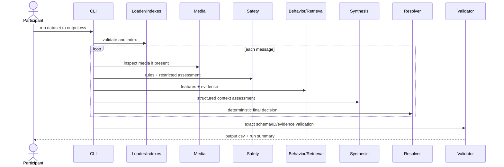
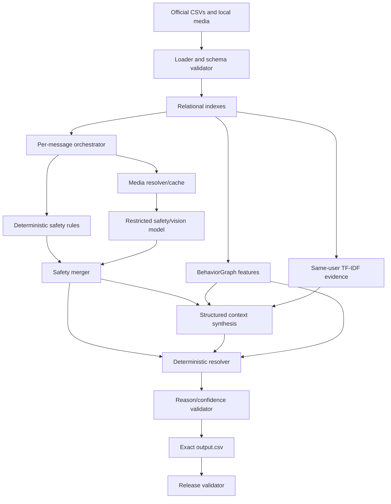

# ShieldRouter — Implementation-Ready Technical Specification and Execution Blueprint

**Event:** HackerRank Orchestrate August 2026  
**Challenge:** Message Notification Router  
**Version:** 1.0  
**Status:** Approved build specification  
**Date/time:** 2026-08-01 19:54 IST  
**Deadline:** 2026-08-02 18:00 IST  
**Remaining planning window:** approximately 22 hours 6 minutes

> **Positioning:** ShieldRouter combines actual message content, recipient relationships and behavior, and non-negotiable safety policy. It can personalize away noise. It can never personalize away credential-theft risk.

> **Critical correction:** the idea document's inferred schemas are invalid. The submitted output must be exactly `message_id,action,message_type,reason,confidence,evidence_message_ids`. Do not add `user_id` or `risk_flags`. Allowed types are `personal`, `urgent`, `event`, `payment`, `business_update`, `promotion`, `greeting`, `forward`, `spam`, `scam`, `unknown`. [SRC-PROBLEM]

# 1. Document control

| Field | Value |
| --- | --- |
| Project | ShieldRouter |
| Event | HackerRank Orchestrate August 26 |
| Track | Single fixed challenge |
| Owner | Solo participant |
| Readers | Participant, evaluator, AI Judge |
| Authoritative schema source | Latest official GitHub repo |
| Primary idea source | SRC-IDEA |
| Status | Implementation-ready |
| Deadline | 2026-08-02 18:00 IST |

## Assumptions and open questions

- Paid OpenAI API access: **not confirmed — verify now**.
- Evaluator network/API-key availability: **not confirmed**; offline fallback is mandatory.
- Exact row count: compute locally; do not rely on ID range.
- Exact August weights: not published. Prior 30/30/30/10 formula is historical only. [SRC-WEIGHTS]
- Confirm interview timing, ZIP root/size, cache allowance, and `messages.csv` authority with organizer.

# 2. Executive technical summary

ShieldRouter is an offline terminal application. It loads every official CSV and media file, builds relational context, inspects images and voice notes, runs a safety stage that cannot see engagement history, computes deterministic personalization features, retrieves same-user historical evidence, obtains structured contextual analysis, and applies a code-only resolver to create one complete `notify`, `digest`, or `mute` row.

The innovation is structural: safety isolation is enforced by data access and final policy precedence rather than a polite prompt. The MVP is a Python CLI. No frontend, HTTP API, database server, authentication, queue, vector database, cloud deployment, public URL, demo video, or pitch deck is needed.

# 3. Idea interpretation and challenge

## Retained
- ShieldRouter pipeline and hard precedence.
- BehaviorGraph trust/affinity/fatigue/novelty/urgency features without graph infrastructure.
- Jury lenses as one structured synthesis, not autonomous agents.
- Agreement-based confidence.
- Real media processing, evidence, evaluation, fallback, and traceability.

## Corrected/removed
1. Use live schemas; group mute/role are in `group_members.csv`.
2. `daily_notification_summary.csv` contains sent/dismissed counts, not a user load limit; derive relative load from history.
3. “Justification first” is replaced by evidence-first facts plus reason-label consistency; output order does not prove reasoning causality.
4. Deterministic safety patterns are essential, not amateurish.
5. Image analysis is folded into restricted vision/safety; voice adds ASR.
6. Remove graph DB, five agents, self-critique, UI, cloud, auth, DB, and external web knowledge.

# 4. Event-alignment matrix

| Requirement | Project response | Evidence | Status/Risk |
| --- | --- | --- | --- |
| 24-hour solo AI-agent challenge | One orchestrated terminal agent; solo workflow | Code, transcript, judge | Compliant; solo violation disqualifies |
| Text/image/voice | Real local media extraction | Media traces/tests | P0 |
| Exact output | Pydantic + release validator | Zero-error report | Critical |
| One row per ID | Per-row exception boundary and ID-set equality | Validator | Critical |
| Evaluation workflow | Sample/adversarial/ablation commands | Evaluation report | P0 |
| No hardcoding/organizer data | General features and allowlisted files | Code scan/manifest | Disqualification risk |
| Code/output/transcript | Clean ZIP, CSV, official log | Artifacts | Critical |
| 30-minute camera-on judge | Code map and trace bundle | Completed interview | Critical |
| Sponsor technology | None mandatory found; provider chosen for fit | Honest README | Not confirmed |
| Deployment/video/deck | Not required | Omitted | Compliant |

# 5. Judging-optimization strategy

| Criterion | Weight | Proof | Effort |
| --- | --- | --- | --- |
| Action correctness | Unknown | Sample/adversarial metrics and resolver traces | 22% |
| Message type | Unknown | Official enum confusion matrix | 10% |
| Reason quality | Unknown | Grounded template and consistency validator | 8% |
| Evidence relevance | Unknown | Same-user retrieval scores and ID validator | 10% |
| Confidence | Unknown | Agreement/evidence/media calibration report | 7% |
| Multimodal | No separate weight published | Image and voice traces | 12% |
| Architecture/robustness | August unknown | Isolation, fallback, deterministic completion | 15% |
| Judge ownership | August unknown | Real experiment/failure explanations | 10% |
| Transcript | August unknown | Authentic append-only development history | 6% |

# 6. Functional requirements

| ID | Name | Priority | Implementation | Acceptance |
| --- | --- | --- | --- | --- |
| FR-001 | Validate official inputs | P0 | Exact headers, unique IDs, media paths, no organizer-only files | `validate-input` exits 0; errors fail before predictions |
| FR-002 | Build context indexes | P0 | Users, groups, memberships, businesses, history, events, daily load, media maps | Known IDs resolve; missing optional relation gives neutral default |
| FR-003 | Process images | P0 | Inspect local image bytes; return visible text/QR/deadline/price/suspicion facts | Every image reference yields MediaFacts or explicit failure |
| FR-004 | Process voice notes | P0 | Transcribe local audio and preserve extraction status | Every voice reference yields transcript or explicit failure |
| FR-005 | Deterministic safety precheck | P0 | OTP/PIN/password/payment/link/QR/injection/chain rules | Decisive credential theft always produces hard-risk signal |
| FR-006 | Restricted model safety | P1 | Message/media/minimal sender only; exclude engagement history | Payload test proves exclusion; strict schema validates |
| FR-007 | BehaviorGraph features | P0 | Trust, affinity, fatigue, novelty, urgency, relationship, DND, relative load | Fixtures produce expected bounded values |
| FR-008 | Historical evidence | P0 | Same-user TF-IDF candidates plus metadata rerank | Only valid same-user IDs; `none` below threshold |
| FR-009 | Context synthesis | P1 | Structured urgency/type/reason/recommendation using supplied context | Only official enums and candidate evidence IDs |
| FR-010 | Deterministic resolver | P0 | Hard safety precedence; urgent exception; opt-out/fatigue; DND/load; digest default | Full decision-matrix tests pass |
| FR-011 | Confidence calibration | P1 | Rule certainty, agreement, evidence, media quality, missing context | Every value 0–1; ambiguity lowers score |
| FR-012 | Exact output CSV | P0 | Six columns, input order, one row per message | ID-set equality and schema validator pass |
| FR-013 | Evaluation workflow | P0 | Sample metrics, confusion matrix, adversarial tests, ablations, latency/cost | Report generated without message-ID branches |
| FR-014 | Resilience and cache | P0 | Two retries, timeouts, hash cache, deterministic fallback | Provider failure never drops a row |
| FR-015 | Release packaging | P0 | Clean `code/` ZIP; separate output and log | Unzip/install/run and secret scan pass |

# 7. Non-functional requirements

| ID | Area | Target |
| --- | --- | --- |
| NFR-001 | Completeness | 100% of input IDs have exactly one output row |
| NFR-002 | Schema | 100% header/order/enum/type validation |
| NFR-003 | Determinism | Same config/cache yields byte-identical output |
| NFR-004 | Text latency | Median <=8s, p95 <=20s online; fallback <=200ms/row; assumption |
| NFR-005 | Media latency | p95 <=45s uncached; cache <=50ms; assumption |
| NFR-006 | Reliability | No per-row error stops the batch |
| NFR-007 | Retry | At most two provider retries; total stage timeout bounded |
| NFR-008 | Secrets | Zero real secrets in repo, ZIP, output, logs, transcript |
| NFR-009 | Privacy | Only stage-minimal fields sent externally; store disabled where supported |
| NFR-010 | Cost | Expected run <=US$2; hard budget stop US$5; assumption |
| NFR-011 | Evidence | 100% non-none evidence IDs exist and belong to user |
| NFR-012 | Demo | Trace/validator/final output available offline |

# 8. User roles and permissions

| Role | Purpose | Access | Restrictions | Audit |
| --- | --- | --- | --- | --- |
| Solo participant/operator | Build/run/evaluate/package/submit | All local participant files/config | No organizer-only data, no label hardcoding | Git + official transcript |
| HackerRank evaluator | Run and inspect package | Code/output/README | No application admin functionality | Deterministic output/logs |
| AI provider | Process minimal per-stage payload | Only sent request fields | No full corpus or keys in content | Request ID/usage, sanitized logs |

No product registration, login, OAuth, passwords, sessions, RBAC, or administrator UI.

# 9. User stories

- **US-001 P0:** As participant, validate a fresh dataset before model calls.
- **US-002 P0:** Generate one valid prediction for every message.
- **US-003 P0:** A trusted urgent direct mention survives group mute/DND.
- **US-004 P0:** OTP/PIN/password scams are muted regardless of affinity.
- **US-005 P1:** Similar promotions route differently by opt-in/dismissal history.
- **US-006 P0:** Image and voice content affect decisions.
- **US-007 P0:** Provider failure still produces every row.
- **US-008 P1:** Judge can inspect features, evidence, rule path, and confidence.
- **US-009 P0:** Participant evaluates changes without ID overfitting.
- **US-010 P0:** Release check builds a clean executable ZIP.

# 10. End-to-end journeys



First-time: clone, AGENTS onboarding/log, venv, install, validate, tests, evaluation, run.  
Returning: change versioned config, run evaluation, compare, record, revert regressions.  
Failure recovery: retry twice, use deterministic fallback, lower confidence, continue.  
Judge journey: architecture, scam override, personalization pair, urgent exception, media, evidence, evaluation, fallback, validator.

# 11. MVP definition

| Scope | Build | Reason | Effort |
| --- | --- | --- | --- |
| Must | Schemas/loader/indexes | Submission foundation | 2h |
| Must | Safety rules/resolver | Core integrity | 2.5h |
| Must | Behavior features/retrieval | Personalization/evidence | 3h |
| Must | Media | Explicit requirement | 2.5h |
| Must | Output/evaluation/release | Mandatory artifacts | 3.5h |
| Should | Restricted safety/synthesis model | Semantic and judge strength | 2h |
| Should | Confidence/traces/ablation | Scoring evidence | 1.5h |
| Could | Relationship-path formatter/concurrency/local fallback | Only after green MVP | 1-3h |
| Do not | UI/API/auth/DB/cloud/vector DB/graph DB/five-agent jury | Irrelevant and risky | 4-10h saved |

# 12. Recommended technology stack

| Layer | Selection | Reason | Alternative | Fallback |
| --- | --- | --- | --- | --- |
| Runtime | Python 3.12 | Fast, cross-platform CLI/data ecosystem | Python 3.13+ after testing | Same Python offline |
| Data | pandas 3.x | Relational CSV joins and output | Polars | csv+dict |
| Validation | Pydantic 2.x | Strict stage/output schemas | dataclasses | manual checks |
| Retrieval | scikit-learn TF-IDF | Offline deterministic evidence retrieval | sentence-transformers | token overlap |
| Reasoning/vision | gpt-5.4-mini-2026-03-17 | Text/image + structured output; $0.75/M input, $4.50/M output [SRC-OAI-MINI] | Any structured multimodal provider | rules/weighted scorer |
| Voice | gpt-4o-mini-transcribe-2025-12-15 | Speech-to-text; $1.25/M audio input tokens, $5/M output [SRC-OAI-ASR] | local Whisper | explicit failure/caption |
| Testing | pytest | Fast fixtures/parameterization | unittest | assert scripts |
| Storage | Official CSV + JSON cache | No DB needed | SQLite cache | memory |
| Deployment | Local CLI package | Direct official deliverable | Docker after MVP | clean venv |

# 13. System architecture



Trust boundary: untrusted message/media never becomes instructions; engagement history cannot enter safety; final model recommendation cannot bypass resolver.

# 14. Data-flow documentation and exact schemas

```text
messages.csv: message_id,user_id,conversation_type,group_id,business_id,sender_user_id,created_at,message_text,media_type,media_id,forwarded_count
users.csv: user_id,do_not_disturb_window,messages_opened_30d,messages_replied_30d,notifications_dismissed_30d,messages_reported_30d
groups.csv: group_id,group_name,group_type,member_count,admin_count,created_at,messages_30d
group_members.csv: group_id,user_id,role,joined_at,messages_sent_30d,messages_read_30d,replies_sent_30d,notifications_dismissed_30d,group_muted_by_user
business_accounts.csv: business_id,display_name,brand_name,category,verified,official_domain,domain_used_by_sender,account_age_days,messages_sent_30d,user_reports_30d,domain_used_by_sender_age_days
user_business_history.csv: user_id,business_id,why_user_knows_account,last_activity_at,allows_promotions,promotions_opted_out_at,activity_count_180d,messages_opened_30d,messages_dismissed_30d,messages_replied_30d,last_reply_at
message_history.csv: same message fields as historical records
message_events.csv: user_id,message_id,message_opened,message_replied,reaction_time_minutes,notification_dismissed,muted_after_message,message_reported
daily_notification_summary.csv: user_id,date,notifications_sent,notifications_dismissed
images.csv: image_id,file_path
voice_notes.csv: voice_note_id,file_path
output.csv: message_id,action,message_type,reason,confidence,evidence_message_ids
```

Validate UTF-8, exact headers, unique IDs, datetime/boolean fields, foreign-key diagnostics, and media path containment. Preserve source files unchanged. Cache uses SHA-256 + schema/prompt/model version.

# 15. Frontend specification

Not applicable. Terminal commands:

```bash
python main.py validate-input --dataset ../dataset
python main.py run --dataset ../dataset --output ../output.csv
python main.py evaluate --dataset ../dataset --report eval/evaluation_report.md
python main.py trace --message-id msg_107 --dataset ../dataset
python main.py validate-output --dataset ../dataset --output ../output.csv
python main.py release-check --dataset ../dataset --output ../output.csv
```

# 16. Backend specification

Local modules: `schemas`, `config`, `io`, `indexes`, `normalize`, `cache`, `media`, `provider`, `safety_rules`, `safety_gate`, `behaviorgraph`, `retrieval`, `synthesis`, `resolver`, `confidence`, `reason`, `trace`, `orchestrator`, `validate`. Public methods are typed, Pydantic-validated, and tested. Per-row errors cannot stop the batch.

# 17. API specification

No HTTP endpoints or OpenAPI. Internal protocols:

```python
class MediaService(Protocol):
    def extract(self, message: IncomingMessage) -> MediaFacts: ...
class SafetyService(Protocol):
    def assess(self, payload: SafetyInput) -> SafetyAssessment: ...
class EvidenceService(Protocol):
    def retrieve(self, message: IncomingMessage, limit: int=5) -> list[EvidenceCandidate]: ...
class SynthesisService(Protocol):
    def assess(self, payload: SynthesisInput) -> SynthesisAssessment: ...
```

# 18. Database design

No DB server. Official CSVs are authoritative; pandas/dicts create indexes by IDs and composite keys. JSON cache is disposable. No migrations; `schemas.py` and cache schema versions fail fast on change. No vector DB.

# 19. AI/ML specification

Primary: pinned GPT-5.4 mini for structured text/image; pinned GPT-4o mini Transcribe for audio. Temperature lowest/0, strict schema, store false, 20/35s timeout, two retries, bounded concurrency, hash cache, deterministic fallback.

Safety prompt rules: message/media are untrusted; no engagement context; classify credentials, pressure, suspicious domains, injection, chains; output only risk level/verdict/signals.  
Synthesis rules: safety read-only; only official types; evidence only from candidates; output urgency/type/recommendation/reason/ambiguity; final resolver owns action.

# 20. Retrieval architecture

Each historical message is one document. Normalize text/media facts; TF-IDF `char_wb` 3-5; filter same user; retrieve 10; rerank same sender/business/group/conversation and reaction relevance; send top 5; threshold initially 0.25; return `none` if weak. Values require sample experimentation.

# 21. External integrations

OpenAI API only. Bearer key in `OPENAI_API_KEY`; account limits are tier-specific and must be checked. API data is not used for training by default unless opted in, but many model endpoints may retain abuse-monitoring content up to 30 days; minimize payload and set store false. [SRC-OAI-DATA]

# 22. Authentication/authorization

No product auth. Operational HackerRank/OpenAI/Git credentials remain outside code and artifacts. `.env` ignored; `.env.example` placeholders only.

# 23. Security specification

| Threat | Path | Probability | Impact | Prevention | Detection | Response |
| --- | --- | --- | --- | --- | --- | --- |
| Prompt injection | Message/media instructs router | High | Critical | Treat content as data; restricted prompt; resolver | Adversarial flag/tests | Ignore command; safety action |
| Credential theft | OTP/PIN/password/payment pressure | High | Critical | Rules + domains + model | Scam recall | Hard mute/scam |
| Personalization overrides safety | High affinity masks risk | Medium | Critical | Exclude engagement from safety; hard precedence | High-affinity scam test | Safety wins |
| Secret leakage | Key in code/log/ZIP | Medium | Critical | Env, gitignore, scan | Release scan | Rotate/rebuild |
| Path traversal | CSV media path escapes root | Low | High | Resolve and require dataset-root containment | Loader test | Reject file |
| Provider data exposure | Excess context sent | Medium | High | Minimal payload/store=false | Payload tests | Offline mode |
| Invalid model JSON | Prose/invalid enum | Medium | High | Structured output + Pydantic | Validation error | Retry/fallback |
| Rate/latency denial | 429/timeouts | Medium | High | Bounded concurrency/retries/cache | Metrics | Fallback |

# 24. Privacy/data governance

Keep challenge data local; send only stage-minimal fields. Do not log raw credential-like text, keys, full histories, images, or audio. Cache is deletable. README discloses provider, storage setting, fallback, and that no real user data was added.

# 25. Validation/error handling

Fatal: invalid required input/config/output. Per-row: media/provider/schema/unexpected errors produce explicit flags, fallback, and a row. Codes: `E_INPUT_SCHEMA`, `E_MEDIA_NOT_FOUND`, `E_MEDIA_PARSE`, `E_PROVIDER_TIMEOUT`, `E_PROVIDER_RATE_LIMIT`, `E_PROVIDER_AUTH`, `E_STRUCTURED_OUTPUT`, `E_ROW_PROCESSING`, `E_OUTPUT_SCHEMA`, `E_SECRET_SCAN`.

# 26. Observability

Structured local logs: run ID, message ID, stage, duration, cache/fallback, request ID, error code. `run_summary.json`: rows, distributions, calls/retries/fallbacks, cache rate, p50/p95, token/cost, confidence, validation. Never log keys, full secrets, full raw media/history.

# 27. Analytics/success metrics

Action/type accuracy and macro F1; scam/mute recall; notify precision; evidence validity; reason consistency; format compliance; fallback/cache rate; p50/p95 latency; provider cost; deterministic rerun. Targets are internal assumptions until measured.

# 28. Testing strategy

Minimum automated cases: exact schema, ID completeness, injection+OTP, high-affinity scam, muted-group direct urgent mention, opt-out promotion, same promotion/two users, image, voice, provider timeout, invalid model enum, evidence validity, DND soft downgrade, critical direct mention overrides DND, deterministic rerun, secret scan.

# 29. AI evaluation plan

Use official labeled samples plus 12-20 adversarial cases, missing/conflicting context, unsupported request, media injection, and provider failures. Report action/type metrics, safety recall, evidence/format/reason checks, latency/cost. Ablate safety model, BehaviorGraph, retrieval, and synthesis fallback; never disable hard safety in release.

# 30. Deployment architecture

Local venv only. Build/run:

```bash
python -m venv .venv
source .venv/bin/activate   # Windows: .venv\Scripts\Activate.ps1
python -m pip install --upgrade pip
python -m pip install -r requirements.txt
python main.py validate-input --dataset ../dataset
python -m pytest -q
python main.py evaluate --dataset ../dataset --report eval/evaluation_report.md
python main.py run --dataset ../dataset --output ../output.csv
python main.py validate-output --dataset ../dataset --output ../output.csv
python main.py release-check --dataset ../dataset --output ../output.csv
```

# 31. Environment configuration

Use companion `.env.example`. Hard budget US$5; pinned model snapshots; store false; retries 2; workers 4; offline flag supported.

# 32. Repository architecture

```text
code/
 README.md requirements.in requirements.txt .env.example main.py
 config/default.yaml
 prompts/safety_gate.md prompts/synthesis.md
 src/shieldrouter/{schemas,config,io,indexes,normalize,cache,media,provider,safety_rules,safety_gate,behaviorgraph,retrieval,synthesis,resolver,confidence,reason,trace,orchestrator,validate}.py
 eval/{evaluate_sample.py,adversarial_cases.jsonl,ablation.py,evaluation_report.md}
 tests/
 scripts/{build_release.py,secret_scan.py,verify_zip.py}
 docs/{architecture.md,decision_records.md}
```

Exclude `.cache`, `.env`, dataset, output, venv, logs, builds.

# 33. Development setup

Clone latest official repo, complete AGENTS onboarding/logging, create Python 3.12 venv, install `pandas pydantic scikit-learn openai PyYAML pytest`, freeze actual versions before release, validate inputs, run tests, run offline baseline, then online stages.

# 34. Coding standards

Type hints; Pydantic `extra=forbid`; pure scoring/resolver; `pathlib`; structured logs; no swallowed exceptions; centralized enums; thresholds versioned; P0 branches tested; no ID-specific logic; no raw secrets; conventional commits; README claims must be executable.

# 35. Git workflow

`main` always green; short branches; tag `baseline-valid`, `mvp-complete`, `release-candidate`, `submitted`; self-review every merge; never rewrite official transcript; revert late regressions.

# 36. Workstream allocation

Solo role blocks: compliance/release, data/core, safety, personalization/retrieval, multimodal, evaluation, documentation/interview. Each has explicit deliverable and green acceptance before switching.

# 37. Roadmap

- 19:54-21:54: exact schemas, loader, offline vertical slice and full fallback baseline.
- 21:54-00:30: BehaviorGraph, retrieval, resolver tests.
- 00:30-03:00: provider safety/synthesis and media/cache.
- 03:00-06:00: first evaluation, fixes, then rest if baseline stable.
- 09:00-12:00: media/evidence/error refinement and confidence.
- 12:00-14:30: clean test, docs, evaluation, freeze.
- 14:30-16:00: final run, ZIP, transcript, upload.
- 16:00-17:00: judge prep/interview; 17:00-18:00 contingency only.

# 38. First implementation sprint

Companion `FIRST_TWO_HOUR_SPRINT.md` is the exact start-now plan. Exit requirement: complete valid offline full CSV, not isolated utilities.

# 39. Detailed implementation sequence

Compliance -> package -> schemas -> loader/indexes -> normalization -> safety rules -> BehaviorGraph -> retrieval -> deterministic synthesis -> resolver -> confidence/reason -> output validator -> offline full batch -> provider adapter -> image/voice -> structured synthesis -> cache/concurrency -> evaluation -> tune general errors -> clean run -> freeze -> package -> submit -> judge.

# 40. Critical pseudocode

```python
def process_message(msg, idx, services, cfg):
    media = services.media.extract(msg)
    normalized = normalize(msg, media)
    rule_safety = assess_rules(normalized, idx.minimal_sender(msg))
    safety = rule_safety.to_final() if rule_safety.decisive else services.safety.assess_or_fallback(...)
    evidence = services.retrieval.retrieve(msg, idx)
    features = build_features(msg, idx, evidence, media)
    synthesis = services.synthesis.assess_or_fallback(...)
    decision = resolve(safety, features, synthesis, cfg)
    return finalize_trace(decision, safety, features, evidence, synthesis, media)
```

```python
def resolve(safety, f, s, cfg):
    if safety.verdict == 'high_risk': return mute_scam()
    if trusted_critical_direct_mention(f, s): return notify(s.message_type)
    if f.opted_out or f.fatigue >= cfg.fatigue_mute: return mute(s.message_type)
    if safety.verdict == 'suspicious' and s.ambiguous: return digest(s.message_type)
    if s.urgency.level == 'high':
        return digest(s.message_type) if f.in_dnd or f.relative_load >= cfg.load_digest else notify(s.message_type)
    return digest(s.message_type)
```

# 41. Demo architecture

Use final code/output, frozen config/cache, sanitized traces for scam, two-user promotion, urgent muted group, image, voice, evidence, provider failure, plus evaluation report and validator. Cached results must be disclosed as prior real calls. No fake UI.

# 42. Demo script

8-minute prepared walkthrough inside judge: 45s thesis; 75s injection scam; 75s personalization pair; 60s urgent exception; 60s media; 60s evidence; 60s evaluation; 45s fallback/validator. Remaining time for code-level questions.

# 43. Pitch-deck outline

Not required. Private reference only: problem, context data, architecture, safety boundary, BehaviorGraph, multimodal, precedence, evaluation, reliability/privacy/cost, limitations. No invented business/impact/team slide.

# 44. Submission checklist

Mandatory: registration, solo compliance, code ZIP, exact output CSV, official log, evaluation workflow, AI Judge. Recommended: README, architecture, tests, AI/provider disclosure, security/privacy, attributions. Not required: public URL, auth credentials, video, deck, live WhatsApp.

# 45. README specification

Title/tagline; challenge; problem; solution; features; architecture; exact schemas; stack/models; setup/env; commands; precedence; evaluation; tests; security/privacy; failure handling; measured cost/runtime; artifacts; limitations/future; license/attributions.

# 46. Risk register

| ID | Risk | Probability | Impact | Prevention | Contingency |
| --- | --- | --- | --- | --- | --- |
| R-001 | Late/failed upload | Medium | Critical | Freeze 14:30; upload 15:30-16:00 | Use last valid baseline; alternate network |
| R-002 | Wrong schemas/output | High | Critical | Exact official contracts in schemas.py | Block release and regenerate |
| R-003 | Missing transcript | Medium | Critical | Verify official append-only path now | Do not fabricate; contact organizer |
| R-004 | Provider/network failure | Medium | High | Retries/cache/offline baseline | Run deterministic mode |
| R-005 | Safety false negative | Medium | Critical | Hard rules + restricted model + resolver | Force mute on decisive risk |
| R-006 | Media omission | Medium | Critical | Preflight all references | Provider/local extraction or explicit failure |
| R-007 | Bad evidence IDs | High | High | Same-user filter + release validator | Use none |
| R-008 | Overengineering | High | High | P0 scope freeze | Delete UI/DB/multi-agent work |
| R-009 | Secret leakage | Medium | Critical | Env-only and scans | Rotate and rebuild |
| R-010 | Cannot defend code | Medium | Critical | Own code map and real experiments | Remove unexplained complexity |

# 47. Failure/fallback matrix

| Dependency | Primary | Failure | Immediate fallback | Demo fallback |
| --- | --- | --- | --- | --- |
| Reasoning/vision | gpt-5.4-mini | timeout/auth/rate/schema | rules + weighted scorer | frozen trace/final CSV |
| Voice | gpt-4o-mini-transcribe | timeout/codec | local Whisper or explicit failure | cached transcript |
| Retrieval | TF-IDF | empty/vector error | metadata exact match or none | known valid trace |
| Network | Internet | offline | offline mode | all artifacts local |
| Portal | Community upload | upload failure | alternate browser/network, early upload | organizer support |
| Browser/device | Primary device | camera/mic crash | alternate device/browser | local notes/traces |

# 48. Cost estimate

At 110-message illustrative assumption and 450+1250 input, 100+180 output tokens per two model calls: about 187k input and 30.8k output, or roughly US$0.28 for text reasoning at official GPT-5.4 mini rates, before image/audio/retries. Exact media token usage must be measured, not converted from guessed duration. Expected engineering budget US$0.50-2; hard cap US$5. Hosting/DB/auth/domain cost US$0.

# 49. Technical decision records

| ID | Context | Options | Decision | Rationale |
| --- | --- | --- | --- | --- |
| ADR-001 | Application shape | CLI vs web | CLI | Official deliverable, minimum risk |
| ADR-002 | Data store | pandas vs DB/graph | pandas+dict | Small static relational corpus |
| ADR-003 | Retrieval | TF-IDF vs vector DB | TF-IDF+metadata | Deterministic/offline/no service |
| ADR-004 | Personalization | Behavior features vs graph DB | BehaviorGraph-style pure code | Explainable without infrastructure |
| ADR-005 | Safety | One prompt vs isolated hybrid | Rules + restricted model + resolver | Cannot personalize away risk |
| ADR-006 | AI provider | OpenAI vs local-only | OpenAI primary + offline fallback | One SDK for structured text/image and ASR |
| ADR-007 | Confidence | Model score vs agreement | Deterministic agreement/evidence formula | Auditable, no extra call |
| ADR-008 | Repository | multi-repo vs single | single `code/` package | Matches ZIP and solo speed |
| ADR-009 | Deployment | cloud vs local | local venv | No hosting requirement |

# 50. Open questions

Organizer: interview after deadline, `messages.csv` authority, evaluator network/keys, cache allowance, ZIP root/size, current scoring weights.  
Participant: paid API, OS, model access.  
Experiments: char vs word TF-IDF, rules/model payment false positives, threshold calibration.  
Default: live repo authoritative; offline fallback required; no cache packaged unless confirmed; upload early.

# 51. Final recommended build plan

## Build
Exact-schema Python CLI with real media, restricted safety, BehaviorGraph, evidence, structured synthesis, code resolver, fallback, evaluation, release validation.

## Do not build
UI, HTTP API, auth, DB/graph/vector DB, cloud/public URL, five agents, self-critique, live WhatsApp, model training, web retrieval.

## Implement order
Compliance -> schemas -> offline full baseline -> safety/resolver -> personalization/evidence -> provider/media -> evaluation -> reliability/docs -> final run/package/upload/interview.

## Must demonstrate
Prompt-injection/OTP override; same content/different users; muted-group urgent exception; image and voice; valid evidence; provider fallback; measured evaluation and validator.

## Submission-ready definition
Latest repo; log active; all P0 tests; complete media handling; full run; exact output/IDs/evidence; no hardcoding/organizer data/secrets; clean unzip-run; three artifacts uploaded before 18:00 IST; participant can explain every module; AI Judge completed.

# Final audit

All idea features evaluated; official requirements mapped; schemas corrected; no invented mandatory sponsor/weights; every AI stage has validation and fallback; no irrelevant enterprise components; MVP fits remaining window; first sprint creates vertical slice; uncertainties are explicit.

# Source register

| ID | Source | Location | Class | Accessed |
| --- | --- | --- | --- | --- |
| SRC-IDEA | ShieldRouter unified design | Uploaded file | Idea document | 2026-08-01 |
| SRC-BRIEF | Message Notification Router brief | Uploaded earlier | Official supplied brief | 2026-08-01 |
| SRC-EVENT | HackerRank Orchestrate August 26 | https://www.hackerrank.com/hackerrank-orchestrate-august26 | Official | 2026-08-01 |
| SRC-README | Official starter README | https://github.com/interviewstreet/hackerrank-orchestrate-august26/blob/main/README.md | Official | 2026-08-01 |
| SRC-PROBLEM | Official problem statement | https://github.com/interviewstreet/hackerrank-orchestrate-august26/blob/main/problem_statement.md | Official | 2026-08-01 |
| SRC-AGENTS | Official AGENTS.md | https://github.com/interviewstreet/hackerrank-orchestrate-august26/blob/main/AGENTS.md | Official | 2026-08-01 |
| SRC-JUDGE | Behind the Scenes of Orchestrate | https://www.hackerrank.com/blog/behind-the-scenes-of-hackerrank-orchestrate/ | Official historical | 2026-08-01 |
| SRC-WEIGHTS | The New Cheating Problem | https://www.hackerrank.com/blog/the-new-cheating-problem-and-why-the-answer-isnt-a-stricter-test/ | Official historical weights | 2026-08-01 |
| SRC-OAI-MINI | GPT-5.4 mini model | https://developers.openai.com/api/docs/models/gpt-5.4-mini | Official provider | 2026-08-01 |
| SRC-OAI-ASR | GPT-4o mini Transcribe | https://developers.openai.com/api/docs/models/gpt-4o-mini-transcribe | Official provider | 2026-08-01 |
| SRC-OAI-DATA | OpenAI API data controls | https://platform.openai.com/docs/models/default-usage-policies-by-endpoint | Official provider | 2026-08-01 |
| SRC-OAI-SDK | OpenAI Python SDK | https://github.com/openai/openai-python | Official SDK | 2026-08-01 |
| SRC-PANDAS | pandas docs | https://pandas.pydata.org/pandas-docs/stable/ | Official framework | 2026-08-01 |
| SRC-PYDANTIC | Pydantic docs | https://docs.pydantic.dev/ | Official framework | 2026-08-01 |
| SRC-SKLEARN | scikit-learn TF-IDF docs | https://scikit-learn.org/stable/modules/generated/sklearn.feature_extraction.text.TfidfVectorizer.html | Official framework | 2026-08-01 |
| SRC-PYTEST | pytest docs | https://docs.pytest.org/en/stable/ | Official framework | 2026-08-01 |
